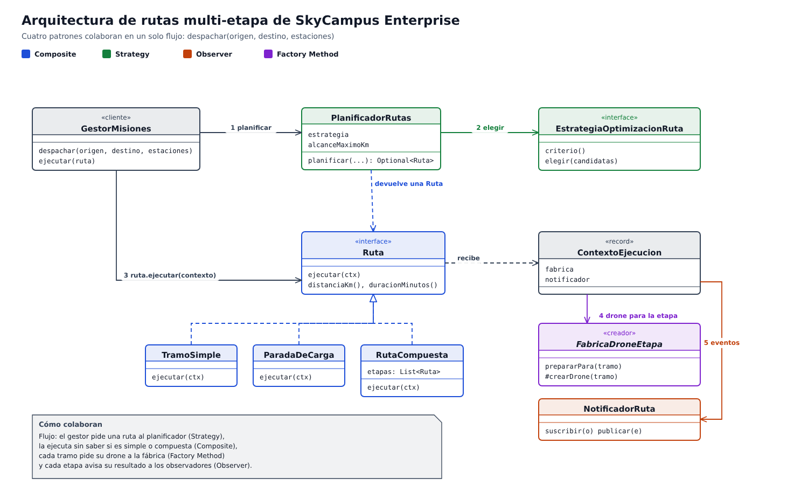
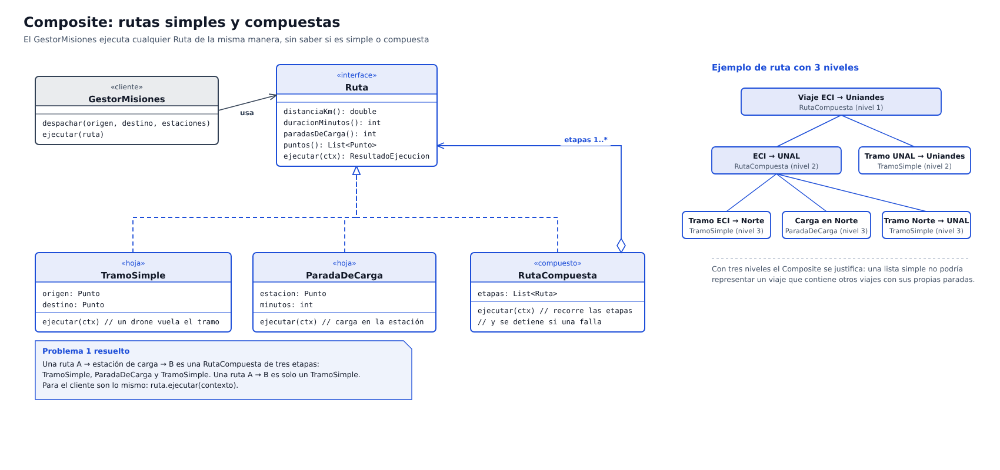
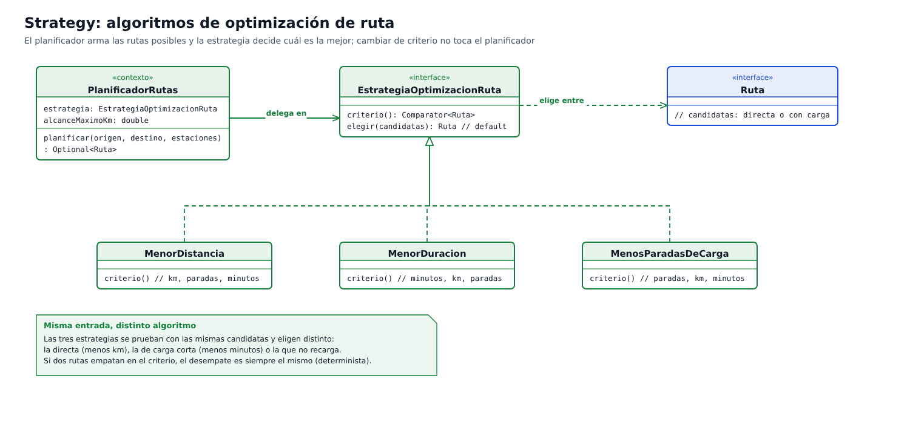
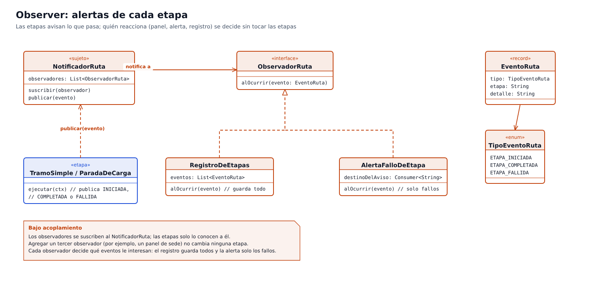
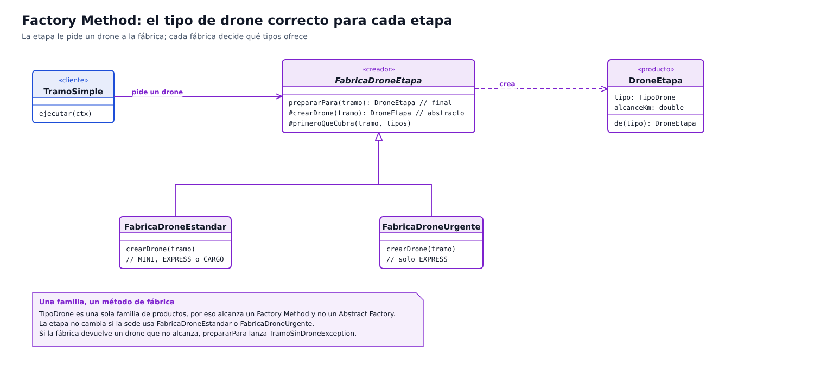

# Infernape 03: arquitectura de rutas multi-etapa con 4 patrones

## Qué se pide

En SkyCampus Enterprise una ruta puede ser simple (punto A a punto B) o compuesta (punto A, estación de carga, punto B). Hay que diseñar la arquitectura con al menos cuatro patrones y, para cada uno, mostrar el diagrama, la implementación en Java y por qué se eligió ese patrón y no otro.

| Patrón | Problema que resuelve | Clases principales | Diagrama |
|---|---|---|---|
| Composite | Calcular y ejecutar rutas simples y compuestas de la misma manera | `Ruta`, `TramoSimple`, `ParadaDeCarga`, `RutaCompuesta` | [01-composite](arquitectura/01-composite.png) |
| Strategy | Elegir la mejor ruta con distintos criterios de optimización | `EstrategiaOptimizacionRuta`, `MenorDistancia`, `MenorDuracion`, `MenosParadasDeCarga`, `PlanificadorRutas` | [02-strategy](arquitectura/02-strategy.png) |
| Observer | Alertar cada etapa sin acoplar las etapas a quien reacciona | `NotificadorRuta`, `ObservadorRuta`, `RegistroDeEtapas`, `AlertaFalloDeEtapa` | [03-observer](arquitectura/03-observer.png) |
| Factory Method | Crear el tipo de drone correcto para cada etapa | `FabricaDroneEtapa`, `FabricaDroneEstandar`, `FabricaDroneUrgente`, `DroneEtapa` | [04-factory-method](arquitectura/04-factory-method.png) |

Todo el código está en el paquete `skycampus.enterprise.ruta`, igual que la v2 se separó del MVP.

## Visión general



1. `GestorMisiones.despachar(origen, destino, estaciones)` pide una ruta al `PlanificadorRutas`.
2. El planificador arma las rutas posibles (la directa y una con parada de carga por cada estación) y la estrategia elige.
3. El gestor ejecuta la ruta con `ruta.ejecutar(contexto)`, sin saber si es simple o compuesta.
4. Cada `TramoSimple` le pide su drone a la fábrica del contexto.
5. Cada etapa publica en el `NotificadorRuta` si se inició, se completó o falló.

## 1. Composite: rutas simples y compuestas



**Problema.** Una ruta A, estación de carga, B tiene tres etapas, y una ruta A a B tiene una. El `GestorMisiones` debe calcularlas y ejecutarlas igual.

**Implementación.** `Ruta` es el componente. `TramoSimple` y `ParadaDeCarga` son las hojas, y `RutaCompuesta` guarda una lista de `Ruta` (que pueden ser otras compuestas) y las recorre en orden:

```java
public ResultadoEjecucion ejecutar(ContextoEjecucion contexto) {
    int completadas = 0;
    for (Ruta etapa : etapas) {
        ResultadoEjecucion resultado = etapa.ejecutar(contexto);
        completadas += resultado.etapasCompletadas();
        if (!resultado.completada()) {
            return ResultadoEjecucion.fallo(completadas);
        }
    }
    return ResultadoEjecucion.exito(completadas);
}
```

La distancia, la duración y las paradas de una compuesta son la suma de sus etapas, y el constructor exige que cada etapa empiece donde termina la anterior.

**Por qué Composite y no otro.** La tabla del enunciado dice que Composite no conviene cuando la jerarquía nunca pasa de 2 niveles, y que en ese caso basta una lista simple con herencia. Aquí sí pasa: un viaje entre sedes puede contener otros viajes con sus propias paradas (viaje ECI a Uniandes, que contiene ECI a UNAL con carga, y UNAL a Uniandes). Son tres niveles, y una lista plana no representaría esa anidación. La prueba `rutaCompuesta_anidada_tieneTresNivelesYSeComportaComoUnaSola` lo verifica.

| Alternativa | Por qué no |
|---|---|
| Lista de tramos con herencia | Solo modela 2 niveles; no puede anidar viajes. |
| `if` en el cliente según el tipo de ruta | El gestor tendría que conocer cada tipo y cambiar cada vez que aparezca uno nuevo. |

## 2. Strategy: algoritmos de optimización de ruta



**Problema.** Para el mismo origen y destino hay varias rutas posibles, y "mejor" significa cosas distintas: menos kilómetros, menos tiempo o menos recargas.

**Implementación.** La interfaz expone el criterio de orden, y el método `elegir` es común:

```java
public interface EstrategiaOptimizacionRuta {
    Comparator<Ruta> criterio();

    default Ruta elegir(List<Ruta> candidatas) {
        return candidatas.stream().min(criterio())
                .orElseThrow(() -> new IllegalArgumentException("No hay rutas candidatas para elegir."));
    }
}
```

`MenorDistancia`, `MenorDuracion` y `MenosParadasDeCarga` solo cambian el comparador; el desempate de cada una es fijo, así que el resultado es determinista. `PlanificadorRutas` recibe la estrategia por constructor, descarta las rutas con un tramo más largo que el alcance máximo y delega la elección.

**Por qué Strategy y no otro.**

| Alternativa | Por qué no |
|---|---|
| `switch` sobre un enum de criterios dentro del planificador | Cada criterio nuevo obliga a modificar el planificador (viola abierto/cerrado). |
| Subclases de `PlanificadorRutas` | Mezcla el armado de candidatas con el criterio y obliga a heredar por cada combinación. |
| Template Method | Fija el algoritmo en una jerarquía; Strategy permite cambiar de criterio en ejecución con una instancia distinta. |

## 3. Observer: alertas de cada etapa



**Problema.** Cuando una etapa empieza, termina o falla, hay que avisar al panel de la sede, al coordinador o a un registro, sin que la etapa conozca a ninguno.

**Implementación.** Las etapas publican un `EventoRuta` (tipo, etapa y detalle) en el `NotificadorRuta`, que avisa a todos los `ObservadorRuta` suscritos:

```java
public void publicar(EventoRuta evento) {
    Validaciones.exigirPresente(evento, "evento");
    observadores.forEach(observador -> observador.alOcurrir(evento));
}
```

`RegistroDeEtapas` guarda todos los eventos y `AlertaFalloDeEtapa` solo reacciona a `ETAPA_FALLIDA` y manda el aviso a un `Consumer<String>`. Los observadores se guardan en una `CopyOnWriteArrayList`, porque las suscripciones pueden cambiar mientras se publican eventos desde otro hilo.

**Por qué Observer y no otro.**

| Alternativa | Por qué no |
|---|---|
| Que la etapa llame directamente al panel y a la alerta | La etapa quedaría acoplada a cada destinatario; agregar uno exige modificarla. |
| Que el gestor consulte (polling) el estado de cada etapa | Se pierde el aviso en el momento exacto y se desperdicia trabajo preguntando. |
| Un único listener fijo | No permite varios destinatarios con intereses distintos (todo, o solo fallos). |

## 4. Factory Method: el drone correcto para cada etapa



**Problema.** Cada tramo necesita un drone con alcance suficiente, y qué tipos se ofrecen depende de la situación: el reparto normal usa el más pequeño que llegue, y el urgente solo usa EXPRESS.

**Implementación.** `FabricaDroneEtapa` es el creador. Su método de fábrica `crearDrone` es abstracto, y la operación pública `prepararPara` lo usa y comprueba que el drone creado alcanza:

```java
public final DroneEtapa prepararPara(TramoSimple tramo) {
    DroneEtapa drone = crearDrone(tramo);
    if (tramo.distanciaKm() > drone.alcanceKm()) {
        throw new TramoSinDroneException("El drone " + drone.tipo() + " no cubre " + tramo.descripcion() + ".");
    }
    return drone;
}
```

`FabricaDroneEstandar` ofrece MINI (3 km), EXPRESS (15 km) y CARGO (30 km) y elige el primero que alcance; `FabricaDroneUrgente` solo ofrece EXPRESS. La etapa solo conoce `FabricaDroneEtapa`.

**Por qué Factory Method y no Abstract Factory.** La tabla del enunciado dice que Abstract Factory no conviene cuando solo hay una familia de componentes, y que en ese caso basta un Factory Method simple. Aquí lo único que se crea es un producto, el drone de una etapa. No hay una familia de objetos que deban ser coherentes entre sí, así que Abstract Factory añadiría interfaces sin beneficio.

| Alternativa | Por qué no |
|---|---|
| `new` o un `switch` por distancia dentro del tramo | El tramo quedaría atado a los tipos de drone y a las reglas de cada sede. |
| Abstract Factory | Solo hay una familia de productos. |
| Singleton para la fábrica | Ver la tabla siguiente. |

## Cuándo no usar un patrón: lo que se evitó

| Patrón | No se usa porque | Qué se hizo en su lugar |
|---|---|---|
| Singleton | La flota y las rutas son estado mutable compartido entre hilos; un singleton lo esconde y lo hace difícil de probar | La fábrica y el notificador llegan por el `ContextoEjecucion` (inyección de dependencias) |
| Abstract Factory | Solo hay una familia de componentes (drones de etapa) | Factory Method simple |

Nota: el enunciado menciona también reportes de formato distinto por sede (HTML, PDF y JSON). Ese sí es un caso de varias familias y encajaría con Abstract Factory, pero este reto pide los cuatro patrones anteriores y no lo incluye.

## Ejemplo de ejecución

Viaje ECI a UNAL (40 km, más que el alcance de cualquier drone) con la estación Norte a 20 km de ambas sedes. Con la fábrica estándar y un `RegistroDeEtapas` suscrito, la ruta elegida pasa por la estación y se publican estos eventos:

| # | Evento | Etapa | Detalle |
|---|---|---|---|
| 1 | `ETAPA_INICIADA` | Tramo ECI -> Estación Norte | |
| 2 | `ETAPA_COMPLETADA` | Tramo ECI -> Estación Norte | drone CARGO |
| 3 | `ETAPA_INICIADA` | Carga en Estación Norte | |
| 4 | `ETAPA_COMPLETADA` | Carga en Estación Norte | 20 min |
| 5 | `ETAPA_INICIADA` | Tramo Estación Norte -> UNAL | |
| 6 | `ETAPA_COMPLETADA` | Tramo Estación Norte -> UNAL | drone CARGO |

Si una etapa no tiene drone que la cubra (por ejemplo, con la fábrica urgente, cuyo alcance es de 15 km), se publica `ETAPA_FALLIDA`, la ruta se detiene y `AlertaFalloDeEtapa` envía el aviso.

## Pruebas

55 pruebas nuevas en `test/skycampus/enterprise/ruta`:

| Grupo | Qué comprueba |
|---|---|
| Composite | Sumas de distancia, duración y paradas; puntos sin repetir la estación; tres niveles; continuidad entre etapas; ejecución en orden; detención ante un fallo |
| Strategy | Cada criterio elige distinto sobre las mismas candidatas; desempates; empate total elige la primera |
| Observer | Varios observadores reciben el mismo evento; la alerta solo avisa fallos; la copia de eventos no se puede modificar |
| Factory Method | Tipo de drone por distancia en los límites (3, 15 y 30 km, y justo encima); la fábrica urgente solo da EXPRESS; una fábrica defectuosa es detectada |
| Planificador y gestor | Directa o con carga según el alcance; tramo igual al alcance es posible; estaciones iguales al origen o destino se ignoran; viaje completo con 6 eventos |

Además se introdujeron 14 defectos a mano (por ejemplo, no detener la ruta al fallar, invertir el orden de los tipos de drone o usar `<` en lugar de `<=` en el alcance) y las pruebas detectaron todos.

JaCoCo mide 100 % en líneas y en ramas, por encima del 85 % que exige el `pom`.

Salida de `mvn clean verify`: [PEGA: últimas líneas con el número de pruebas y `BUILD SUCCESS`]
