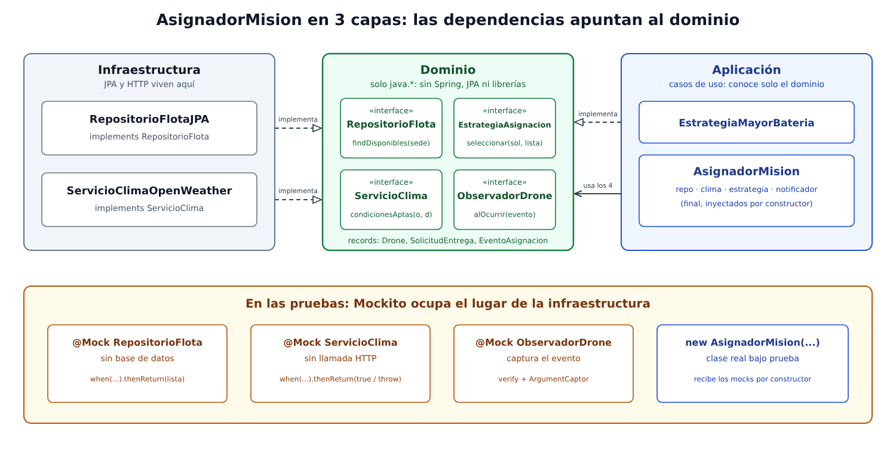

# Infernape 04: AsignadorMision en tres capas, probado sin clima real ni base de datos

## Qué se pide

Implementar el `AsignadorMision` de SkyCampus Enterprise con tres capas (dominio, aplicación, infraestructura), demostrar con pruebas hechas solo con Mockito que la capa de aplicación funciona sin ninguna llamada HTTP ni base de datos reales, y garantizar que el dominio (records e interfaces) no importa ninguna anotación de Spring ni librería externa.



## Las tres capas

| Capa | Paquete | Qué contiene | Puede importar |
|---|---|---|---|
| Dominio | `skycampus.enterprise.dominio` | Records `Drone`, `SolicitudEntrega`, `EventoAsignacion`; enum `TipoEventoAsignacion`; interfaces `RepositorioFlota`, `ServicioClima`, `EstrategiaAsignacion`, `ObservadorDrone` | Solo `java.*` y su propio paquete |
| Aplicación | `skycampus.enterprise.aplicacion` | `AsignadorMision` (el caso de uso) y `EstrategiaMayorBateria` | `java.*` y el dominio |
| Infraestructura | `skycampus.enterprise.infraestructura` | `RepositorioFlotaJPA` y `ServicioClimaOpenWeather` | `java.*` y el dominio (nunca la aplicación) |

La regla es que las flechas apuntan hacia el dominio: infraestructura implementa sus interfaces, la aplicación las usa, y el dominio no sabe que existen las otras dos.

## Cómo queda el AsignadorMision

```java
public class AsignadorMision {

    private final RepositorioFlota repo;
    private final ServicioClima clima;
    private final EstrategiaAsignacion estrategia;
    private final ObservadorDrone notificador;

    public AsignadorMision(RepositorioFlota repo, ServicioClima clima,
            EstrategiaAsignacion estrategia, ObservadorDrone notificador) { ... }

    public Optional<Drone> asignar(SolicitudEntrega solicitud) { ... }
}
```

El flujo de `asignar` es:

1. Pregunta al `ServicioClima` si el trayecto origen a destino es apto. Si responde que no, o si lanza una excepción, publica `CLIMA_ADVERSO` y termina (falla segura: sin clima confiable no se despega). En ese caso ni siquiera consulta la flota.
2. Pide al `RepositorioFlota` los drones disponibles de la sede de origen y descarta los de batería menor a 30 %.
3. Delega en la `EstrategiaAsignacion` la elección. Sin candidatos publica `SIN_DRONE_DISPONIBLE`; con candidato publica `MISION_ASIGNADA`.

Los cuatro campos son `final` y llegan por constructor. La clase no crea nada con `new` ni conoce clases concretas de infraestructura, así que quien la construye decide con qué la conecta: en producción con `RepositorioFlotaJPA` y `ServicioClimaOpenWeather`, en las pruebas con mocks.

## Cómo se demuestra que no hay HTTP ni base de datos

`AsignadorMisionTest` usa solo `@Mock` de Mockito para `RepositorioFlota`, `ServicioClima` y `ObservadorDrone` (y una estrategia falsa en una prueba). Lo que se verifica:

| Prueba | Qué demuestra |
|---|---|
| `asigna_conClimaApto_eligeMayorBateria` | El caso feliz corre con datos fabricados con `when(...).thenReturn(...)`; `verifyNoMoreInteractions` confirma que no se tocó nada más. |
| `asigna_conClimaNoApto_noTocaElRepositorio` | Con clima adverso el repositorio no se usa (`verifyNoMoreInteractions(repo)`): no se gasta una consulta a la base de datos. |
| `asigna_siElClimaLanzaExcepcion_noVuela` | Una caída del servicio externo se simula con `thenThrow`, sin red real. |
| `asigna_respetaBateriaMinima` | Límite 29, 30 y 31 con `@CsvSource`. |
| `asigna_delegaLaEleccionEnLaEstrategia` | La estrategia recibe solo los candidatos filtrados. |
| `asigna_consultaLaSedeDeOrigen` | El repositorio se consulta por la sede de origen y no por otra. |

Además, `ArquitecturaCapasTest` hace verificable la separación: lee los `import` de los archivos fuente de cada capa y falla si el dominio importa algo que no sea `java.*` o su paquete, si el dominio lleva anotaciones distintas de `@Override`, si la aplicación importa algo de infraestructura o de un framework, o si la infraestructura importa la aplicación. Incluye una prueba del propio detector (`detector_reconoceViolaciones`) con un código "sucio" que importa Spring, para que la regla no pase en vacío. Si alguien agrega `@Entity` o `import org.springframework...` al dominio, el build falla.

Las clases de infraestructura no aparecen en ninguna prueba de la capa de aplicación. Su único test (`AdaptadoresInfraestructuraTest`) comprueba que implementan los puertos y que, mientras no se integren JPA y HTTP, lanzan `UnsupportedOperationException` en vez de inventar datos.

## Decisiones

- **Las interfaces `EstrategiaAsignacion` y `ObservadorDrone` están en el dominio.** El enunciado lista `RepositorioFlota` y `ServicioClima` como interfaces del dominio y muestra la estrategia y el observador como dependencias del asignador; al ser contratos que la aplicación necesita y que otros pueden implementar, viven junto a los demás puertos. La implementación concreta (`EstrategiaMayorBateria`) está en aplicación porque es una regla de negocio sin dependencias externas.
- **El dominio no usa `util.Validaciones`.** Esa clase es del proyecto, pero está fuera del paquete del dominio; para cumplir "no importa ninguna librería externa" al pie de la letra, los records validan con código propio de pocas líneas.
- **Se consulta el clima antes que la flota.** Es la comprobación más barata de descartar y evita una consulta a la base de datos cuando de todos modos no se puede volar.
- **Esqueletos de infraestructura.** El proyecto todavía no incluye JPA ni un cliente HTTP, y agregarlos solo para este reto sería meter dependencias que nada usa. Los adaptadores quedan como esqueleto con el comentario de dónde irá cada cosa.
- **Este es el `AsignadorMision` de Enterprise.** El de v2 (`skycampus.v2.service`) y el del MVP no se tocan, así que sus pruebas siguen igual.

## Por qué esta arquitectura y no otra

| Alternativa | Por qué no |
|---|---|
| El asignador crea `new ServicioClimaOpenWeather()` por dentro | Para probarlo habría que llamar al clima real o usar herramientas de reemplazo de constructores; el acoplamiento esconde la dependencia. |
| Poner `@Repository` / `@Entity` en el dominio | El modelo quedaría atado a Spring y JPA; cambiar de persistencia obligaría a tocar el dominio. |
| Un solo paquete para todo | Nada impediría que el dominio importara infraestructura sin que nadie lo notara; con tres paquetes y el test de imports, la regla se vigila sola. |

## Verificación

- Pruebas nuevas: `AsignadorMisionTest`, `EstrategiaMayorBateriaTest`, `ModeloDominioTest`, `AdaptadoresInfraestructuraTest`, `ArquitecturaCapasTest`.
- Cobertura de las tres capas nuevas: 100 % de líneas y de ramas.
- Mutación manual: 19 mutantes (invertir la condición del clima, `>=` por `>` en la batería mínima, cambiar origen por destino, cambiar el tipo de evento, desempate por id, validaciones de los records, entre otros), todos detectados por alguna prueba.
