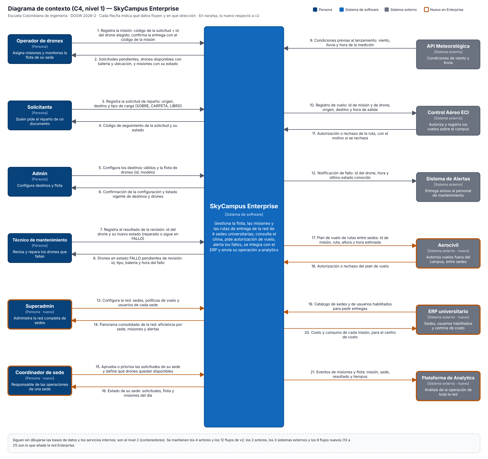
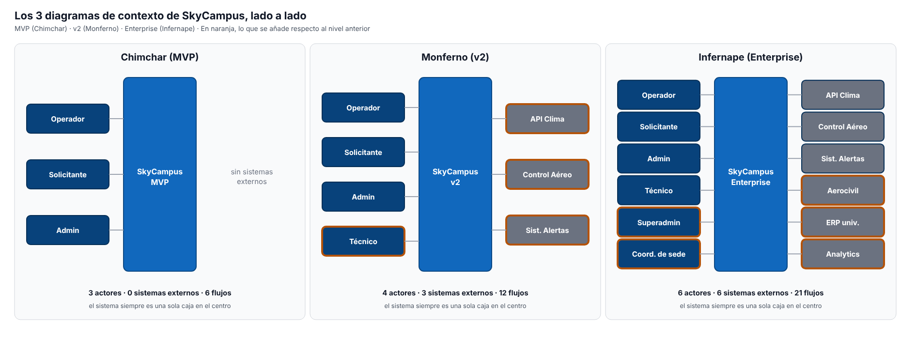
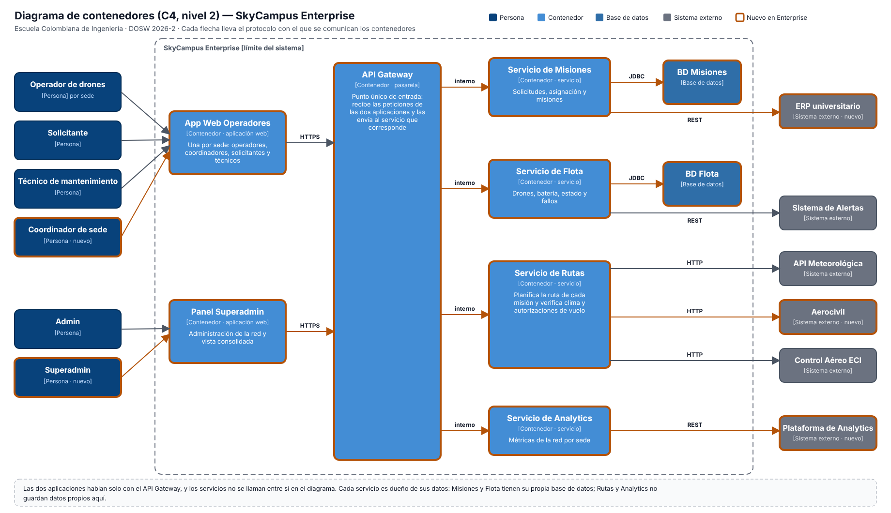

# Infernape 05: C4 nivel 1 y nivel 2 de SkyCampus Enterprise

## Qué se pide

Dibujar el C4 nivel 1 (contexto) y el nivel 2 (contenedores) de la red Enterprise, comparar en un mismo documento los tres diagramas de contexto (MVP, v2 y Enterprise) y explicar qué creció, qué se mantuvo y cómo evolucionó la complejidad sin perder la coherencia.

## 1. Contexto Enterprise (C4 nivel 1)

Archivos: [`contexto-skycampus-enterprise.svg`](c4/contexto-skycampus-enterprise.svg) y [`contexto-skycampus-enterprise.png`](c4/contexto-skycampus-enterprise.png). En naranja, lo nuevo respecto a v2.

### Actores y sistemas
| Elemento | Tipo | Qué hace | ¿Nuevo? |
|---|---|---|---|
| Operador de drones | Persona | Asigna misiones y monitorea la flota de su sede | No |
| Solicitante | Persona | Pide el reparto de un documento | No |
| Admin | Persona | Configura destinos y flota | No |
| Técnico de mantenimiento | Persona | Revisa y repara los drones que fallan | No (v2) |
| Superadmin | Persona | Administra la red completa de sedes | **Sí** |
| Coordinador de sede | Persona | Responsable de las operaciones de una sede | **Sí** |
| SkyCampus Enterprise | Sistema de software | Gestiona flota, misiones y rutas de la red de 4 sedes | Evoluciona de v2 |
| API Meteorológica | Sistema externo | Entrega las condiciones de viento y lluvia | No (v2) |
| Control Aéreo ECI | Sistema externo | Autoriza y registra los vuelos sobre el campus | No (v2) |
| Sistema de Alertas | Sistema externo | Entrega avisos al personal de mantenimiento | No (v2) |
| Aerocivil | Sistema externo | Autoriza los vuelos fuera del campus, entre sedes | **Sí** |
| ERP universitario | Sistema externo | Fuente de sedes y usuarios; recibe el costo de cada misión | **Sí** |
| Plataforma de Analytics | Sistema externo | Analiza la operación de toda la red | **Sí** |

### Flujos de datos
Los flujos 1 a 12 son los de v2, con los mismos datos y el mismo número (detalle en [`MONFERNO05-CONTEXTO-V2.md`](MONFERNO05-CONTEXTO-V2.md)). Los nuevos continúan la numeración:

| # | Dirección | Datos |
|---|---|---|
| 13 | Superadmin → SkyCampus | Sedes, políticas de vuelo y usuarios de cada sede |
| 14 | SkyCampus → Superadmin | Panorama consolidado de la red: eficiencia por sede, misiones y alertas |
| 15 | Coordinador de sede → SkyCampus | Aprobación o priorización de las solicitudes de su sede; drones que quedan disponibles |
| 16 | SkyCampus → Coordinador de sede | Estado de su sede: solicitudes, flota y misiones del día |
| 17 | SkyCampus → Aerocivil | Plan de vuelo de rutas entre sedes: id de misión, ruta, altura y hora estimada |
| 18 | Aerocivil → SkyCampus | Autorización o rechazo del plan de vuelo |
| 19 | ERP universitario → SkyCampus | Catálogo de sedes y de usuarios habilitados para pedir entregas |
| 20 | SkyCampus → ERP universitario | Costo y consumo de cada misión, para el centro de costo |
| 21 | SkyCampus → Plataforma de Analytics | Eventos de misiones y flota: misión, sede, resultado y tiempos |

## 2. Los tres contextos en un mismo documento

Los diagramas completos de cada nivel, con todos sus flujos:

| Nivel | Diagrama |
|---|---|
| Chimchar (MVP) | [contexto-skycampus.png](c4/contexto-skycampus.png) (detalle en [`RETO05-CONTEXTO-C4.md`](RETO05-CONTEXTO-C4.md)) |
| Monferno (v2) | [contexto-skycampus-v2.png](c4/contexto-skycampus-v2.png) (detalle en [`MONFERNO05-CONTEXTO-V2.md`](MONFERNO05-CONTEXTO-V2.md)) |
| Infernape (Enterprise) | [contexto-skycampus-enterprise.png](c4/contexto-skycampus-enterprise.png) (sección 1 de este documento) |

| Nivel | Actores | Sistemas externos | Flujos |
|---|---|---|---|
| Chimchar (MVP) | Operador, Solicitante, Admin (3) | Ninguno (0) | 6 |
| Monferno (v2) | + Técnico de mantenimiento (4) | + API Clima, Control Aéreo, Sistema de Alertas (3) | 12 |
| Infernape (Enterprise) | + Superadmin, Coordinador de sede (6) | + Aerocivil, ERP universitario, Analytics platform (6) | 21 |

### ¿Qué creció?
- **Actores:** de 3 a 4 y a 6. Cada nivel añade quien necesita el sistema a esa escala: el técnico cuando hay fallos que atender, el superadmin y el coordinador cuando hay varias sedes.
- **Sistemas externos:** de 0 a 3 y a 6. El salto del MVP a v2 fue pasar de no hablar con nadie a depender de terceros; el de v2 a Enterprise duplica esa dependencia, y cada tercero nuevo responde a una necesidad distinta (permiso de vuelo entre sedes, datos y costos de la universidad, análisis de la red).
- **Flujos:** de 6 a 12 y a 21. Los 9 nuevos de Enterprise son todos de actores o sistemas nuevos; ninguno cambia lo que ya existía.
- **Condiciones para volar:** del MVP (drone disponible y con batería) a v2 (además clima y autorización del Control Aéreo) y a Enterprise (además, en rutas entre sedes, autorización de la Aerocivil).

### ¿Qué se mantuvo?
- **El sistema sigue siendo una sola caja en el centro.** En los tres diagramas SkyCampus es un único sistema; todo lo que se agregó entra por sus costados.
- **Los actores y los flujos anteriores no cambian.** Los 3 actores del MVP conservan sus flujos 1 a 6 con los mismos datos, y el Técnico y los 3 externos de v2 conservan los flujos 7 a 12. Los números no se reutilizan: lo nuevo se numera a continuación.
- **El propósito:** gestionar flota, misiones y entregas de drones. Enterprise lo hace para 4 sedes en vez de un campus, pero el problema es el mismo.
- **Las convenciones del dibujo:** personas a la izquierda, externos a la derecha, una flecha por tipo de dato con su dirección, naranja para lo nuevo.
- **Lo que sigue fuera del diagrama de contexto:** bases de datos, correo o PDF. Los detalles técnicos se movieron al nivel 2 en vez de ensuciar el nivel 1.

### ¿Cómo evolucionó la complejidad sin perder la coherencia?
1. **La complejidad se añadió, no se reescribió.** Cada nivel es el anterior más piezas nuevas. Quien conoce el MVP reconoce el 100 % de lo que ya había en v2 y en Enterprise.
2. **Cada pieza nueva responde a una necesidad concreta y entra por un solo lugar.** Un actor nuevo aporta dos flujos (lo que envía y lo que recibe); un externo nuevo aporta uno o dos. Nada se conecta a todo.
3. **Los detalles bajan de nivel en vez de subir.** Al crecer, el nivel 1 siguió siendo legible (una caja y sus vecinos) y la complejidad interna se mostró en el nivel 2, con sus propios contenedores y protocolos. Ese es el motivo de existir de los niveles de C4.
4. **El código siguió el mismo criterio.** v2 se separó del MVP en su propio paquete y Enterprise se separó de v2 (`skycampus.enterprise.*`), de modo que las pruebas anteriores no se tocaron al crecer. Y cada dependencia externa es una interfaz del dominio (`ServicioClima`, `RepositorioFlota`, `ObservadorDrone`), así que sumar un tercero es sumar un adaptador, no cambiar las reglas (Infernape 04).

## 3. Contenedores Enterprise (C4 nivel 2)

Archivos: [`contenedores-skycampus-enterprise.svg`](c4/contenedores-skycampus-enterprise.svg) y [`contenedores-skycampus-enterprise.png`](c4/contenedores-skycampus-enterprise.png).

| Contenedor | Tipo | Qué hace | Se comunica con | Protocolo |
|---|---|---|---|---|
| App Web Operadores (por sede) | Aplicación web | Interfaz de operadores, coordinadores, solicitantes y técnicos de una sede | API Gateway | HTTPS |
| Panel Superadmin | Aplicación web | Administración de la red y vista consolidada | API Gateway | HTTPS |
| API Gateway | Pasarela | Recibe las peticiones de las dos aplicaciones y las envía al servicio que corresponde | Los 4 servicios | Interno |
| Servicio de Misiones | Servicio | Solicitudes, asignación y misiones | BD Misiones; ERP universitario | JDBC; REST |
| Servicio de Flota | Servicio | Drones, batería, estado y fallos | BD Flota; Sistema de Alertas | JDBC; REST |
| Servicio de Rutas | Servicio | Planifica la ruta y verifica clima y autorizaciones de vuelo | API Meteorológica, Aerocivil, Control Aéreo ECI | HTTP |
| Servicio de Analytics | Servicio | Métricas de la red por sede | Plataforma de Analytics | REST |
| BD Misiones, BD Flota | Base de datos | Datos propios de cada servicio | Su servicio | JDBC |

Los 7 contenedores, las dos bases de datos y los protocolos HTTPS, interno, JDBC, HTTP y REST de las flechas hacia Gateway, bases de datos, Rutas y Analytics son los del enunciado. Los 6 sistemas externos del nivel 1 aparecen otra vez en el nivel 2, cada uno conectado al contenedor que lo usa, para que los dos niveles sean coherentes entre sí; los enlaces del Control Aéreo, el Sistema de Alertas y el ERP (y su protocolo) son decisión mía, explicada abajo.

### Cómo se relaciona con el código actual
Hoy todo está en un solo módulo Maven (un monolito modular); los contenedores son la arquitectura objetivo y los paquetes ya marcan por dónde se cortaría:

| Contenedor | Dónde está hoy en el código |
|---|---|
| Servicio de Analytics | `skycampus.enterprise.analytics` (Infernape 01) |
| Servicio de Rutas | `skycampus.enterprise.ruta` (Infernape 03: Composite, Strategy, Observer, Factory Method) |
| Servicio de Misiones | `AsignadorMision` en `skycampus.enterprise.aplicacion` (Infernape 04) |
| Servicio de Flota | El puerto `RepositorioFlota` y el record `Drone`; el adaptador `RepositorioFlotaJPA` (que usaría JDBC) es un esqueleto |
| Integraciones externas | `ServicioClimaOpenWeather` es un esqueleto; la alerta técnica existe como observador (`AlertaTecnico`); Aerocivil, ERP y Analytics no están construidos |

## Supuestos y decisiones
- **Los flujos nuevos (13 a 21) son decisión mía.** El enunciado solo da los nombres de los actores y sistemas nuevos y una lista de contenedores; los datos que viajan por cada flecha y su dirección los definí yo con el mismo criterio que en v2.
- **Dirección de las flechas con los externos nuevos.** La Aerocivil es de doble vía (plan de vuelo hacia afuera, autorización hacia adentro, como el Control Aéreo). El ERP también: entrega sedes y usuarios, y recibe el costo de cada misión. Analytics solo recibe datos, como indica `REST → Plataforma Analytics`.
- **Quién usa qué aplicación.** El enunciado lista solo dos aplicaciones. Asigné a la App Web Operadores a los operadores, coordinadores, solicitantes y técnicos (con permisos distintos por rol), y al Panel Superadmin al Superadmin y al Admin. Es una decisión mía.
- **Dónde se conectan los externos que el enunciado no menciona en los contenedores.** El enunciado solo muestra `Servicio de Rutas → API Clima / Aerocivil` y `Servicio de Analytics → Plataforma Analytics`. Conecté el Control Aéreo ECI al Servicio de Rutas (es quien autoriza la ruta), el Sistema de Alertas al Servicio de Flota (es quien conoce los fallos) y el ERP al Servicio de Misiones (de ahí sale el costo). Son decisiones mías para mantener los dos niveles coherentes.
- **El clima en el código y en el diagrama.** En el código, el puerto `ServicioClima` lo usa el `AsignadorMision` (Misiones); en el diagrama, siguiendo el enunciado, lo consulta el Servicio de Rutas. Es una diferencia que habría que resolver al separar los servicios.
- **Los servicios no se llaman entre sí en el diagrama.** Solo hablan con el API Gateway, su base de datos y los externos; si en la implementación se necesita comunicación entre servicios, se añade como flecha nueva.
- **Qué está construido.** Los diagramas son la arquitectura objetivo. En el código existen la analítica, las rutas con sus patrones y el asignador por capas; las integraciones con el mundo exterior son esqueletos o no existen.
