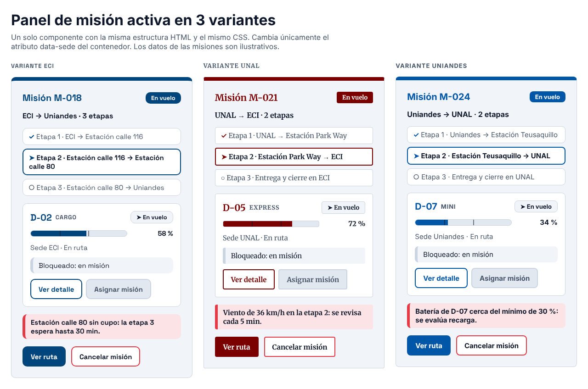
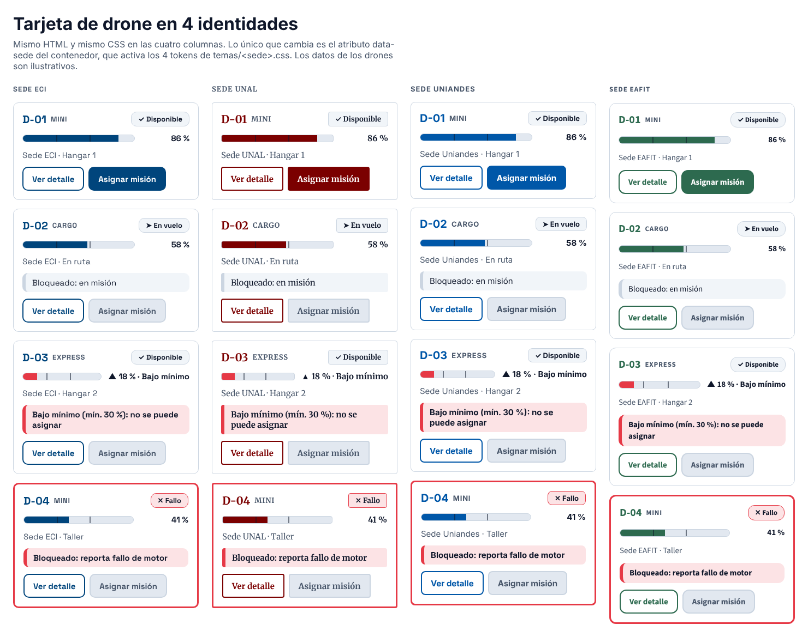

# Infernape · Reto 08 — Design tokens multi-sede de SkyCampus Enterprise

SkyCampus Enterprise es una sola aplicación para 4 universidades. Cada una tiene su identidad, pero los componentes (Tarjeta de drone, Panel de misión activa, Indicador de batería) son idénticos. Lo que cambia entre sedes son **4 variables** (design tokens). Este documento las especifica y demuestra, con pruebas automáticas, que añadir una sede solo exige definir esos 4 valores.

Todo vive en `docs/diseno/`:

| Archivo | Para qué sirve |
|---|---|
| `temas/eci.css`, `unal.css`, `uniandes.css`, `eafit.css` | Los 4 tokens de cada sede. Es lo único que se escribe para una sede nueva |
| `base.css` | Variables compartidas por todas las sedes (neutros, espacios, tamaños). Ninguna sede las redefine |
| `componentes.css` | Los 3 componentes. No tiene colores, fuentes ni radios propios: todo sale de `var(--...)` |
| `demo.css` | Solo la rejilla de las páginas de demostración |
| `panel-mision-activa.html` | El panel en 3 variantes (ECI, UNAL, Uniandes) |
| `tarjeta-drone.html` | La tarjeta de drone en 4 identidades (las 3 pedidas y EAFIT) y 4 estados cada una |
| `capturas/*.png` | Capturas de esas dos páginas |

## 1. Los 4 tokens por sede

| Token | ECI | UNAL | Uniandes | EAFIT |
|---|---|---|---|---|
| `--color-primary` | `#00457C` | `#7B0000` | `#0057A8` | `#2D6A4F` |
| `--color-alert` | `#E63946` | `#E63946` | `#E63946` | `#E63946` |
| `--font-ui` | `"Space Grotesk", system-ui, sans-serif` | `"Merriweather", Georgia, serif` | `"Inter", system-ui, sans-serif` | `"Source Sans 3", "Source Sans Pro", system-ui, sans-serif` |
| `--border-radius` | `10px` | `4px` | `8px` | `12px` |

Reglas de cada token:

| Token | Formato | Para qué se usa | Regla que se verifica |
|---|---|---|---|
| `--color-primary` | `#RRGGBB` | Identidad: botones, título y estado del panel, borde superior, id del drone, relleno de la batería | Texto blanco sobre este color debe dar al menos 4,5:1 (WCAG AA). Dos sedes no comparten primario |
| `--color-alert` | `#RRGGBB` | Avisos y errores: borde izquierdo y fondo suave de los avisos, borde de la tarjeta en fallo, batería bajo el mínimo, botón de cancelar | Es `#E63946` en las 4 sedes: una alerta debe verse igual en cualquier universidad |
| `--font-ui` | Lista de familias separadas por coma | Toda la tipografía de los componentes | Al menos una familia de respaldo y la última es `sans-serif` o `serif` |
| `--border-radius` | `Npx`, de 1 o 2 cifras | Esquinas de botones, tarjetas, panel, avisos y barra de batería | Siempre se aplica con `var(--border-radius)`, nunca con un número |

Notas:
- **Source Sans.** El enunciado dice "Source Sans"; en Google Fonts la familia se llama `Source Sans 3`, por eso es la primera de la lista. `Source Sans Pro` queda como respaldo para quien la tenga instalada.
- **Los colores y fuentes de las sedes salen de la tabla del enunciado.** No los contrasté con el manual de marca oficial de cada universidad.

### Variables compartidas (`base.css`)

Estas no cambian entre sedes y una sede no las toca:

| Variable | Valor | Uso |
|---|---|---|
| `--color-on-primary` | `#FFFFFF` | Texto sobre el color primario |
| `--color-surface` | `#FFFFFF` | Fondo de tarjetas |
| `--color-fondo` | `#F1F5F9` | Fondo del panel y de los avisos informativos |
| `--color-text` | `#0F172A` | Texto principal (17,9:1 sobre blanco) |
| `--color-text-suave` | `#475569` | Texto secundario (7,6:1 sobre blanco, 6,9:1 sobre `--color-fondo`) |
| `--color-borde` | `#CBD5E1` | Bordes neutros |
| `--color-pista` | `#E2E8F0` | Pista de la barra de batería y botones deshabilitados |
| `--espacio-1` a `--espacio-5` | 4, 8, 12, 16 y 24 px | Separaciones |
| `--texto-xs`, `--texto-sm`, `--texto-md`, `--texto-lg` | 0,8125, 0,9375, 1 y 1,25 rem | Tamaños de texto |
| `--alto-control` | `44px` | Alto mínimo de los botones |

## 2. Qué token usa cada componente

| Componente | `--color-primary` | `--color-alert` | `--font-ui` | `--border-radius` |
|---|---|---|---|---|
| Botón | Fondo y borde; texto en el botón secundario | Borde del botón de cancelar | Sí | Sí |
| Indicador de batería | Relleno de la barra | Relleno cuando está bajo el 30 % | Hereda | Pista de la barra |
| Tarjeta de drone | Id del drone | Borde en fallo, aviso de alerta | Hereda | Tarjeta, estado y avisos |
| Panel de misión activa | Borde superior, título, estado y etapa actual | Aviso de la misión | Hereda | Panel, etapas y avisos |

Las pruebas verifican que cada uno de los 4 tokens se usa de verdad en `componentes.css`: ninguno es letra muerta.

## 3. Panel de misión activa en 3 variantes



Página: [`diseno/panel-mision-activa.html`](diseno/panel-mision-activa.html).

**Qué contiene el panel, siempre en el mismo orden:** título de la misión y su estado, la ruta, la lista de etapas (completada, actual o pendiente), la tarjeta del drone asignado, un aviso de alerta y las acciones "Ver ruta" y "Cancelar misión".

**Qué cambia entre una variante y otra:** únicamente el atributo `data-sede` del contenedor (`eci`, `unal` o `uniandes`). Ese atributo activa el bloque de tokens de `temas/<sede>.css`. El HTML y el CSS del panel son los mismos en las tres. Las diferencias que se ven en la captura (color, tipografía, esquinas) son solo el efecto de los 4 tokens.

Los datos de las misiones (M-018, M-021, M-024, los drones y las estaciones) son ilustrativos.

## 4. La Tarjeta de drone funciona con las identidades sin cambiar su estructura



Página: [`diseno/tarjeta-drone.html`](diseno/tarjeta-drone.html). Muestra 4 sedes por 4 estados (Disponible, En vuelo, Disponible bajo el mínimo y Fallo), 16 tarjetas en total.

Cómo se demuestra que la estructura no cambia (`DesignTokensTest`):

| Afirmación | Cómo se comprueba |
|---|---|
| Las 16 tarjetas tienen la misma estructura HTML | Se extrae de cada una la secuencia de etiquetas y clases, sin textos ni valores, y las 16 secuencias son iguales |
| La tarjeta dentro del panel es la misma que la suelta | Su secuencia es igual a la de la tarjeta suelta |
| Las 3 variantes del panel tienen la misma estructura | Las 3 secuencias son iguales, y los contenedores solo difieren en `data-sede` |
| El CSS no sabe de ninguna sede | `componentes.css` no tiene colores en hexadecimal ni `rgb()`, ni colores por nombre, ni nombres de fuente, ni radios en píxeles; las fuentes y los radios solo se aplican con `var(--font-ui)` y `var(--border-radius)` |
| Las páginas no se saltan los tokens | No tienen bloques `<style>` ni estilos en línea, salvo `--nivel` (el porcentaje de la batería, que es un dato) |
| Solo las sedes definen los 4 tokens | Ni `base.css`, ni `componentes.css`, ni `demo.css` los declaran |
| Cada sede usada tiene su tema | Cada `data-sede` de las páginas tiene su archivo en `temas/` y está enlazado |

**Cómo se ve el estado sin depender del color.** El estado de cada tarjeta se lee por el texto del chip y por un símbolo (marca de verificación, flecha, rayo, equis, engranaje); el color de alerta se suma al borde y al fondo del aviso, nunca va solo. Cada botón deshabilitado dice la razón en la misma tarjeta ("Bloqueado: en misión", "Bajo mínimo (mín. 30 %)").

## 5. Accesibilidad de los tokens

| Sede | Texto blanco sobre `--color-primary` | ¿Cumple 4,5:1? |
|---|---|---|
| ECI `#00457C` | 9,80:1 | Sí |
| UNAL `#7B0000` | 11,40:1 | Sí |
| Uniandes `#0057A8` | 7,17:1 | Sí |
| EAFIT `#2D6A4F` | 6,39:1 | Sí |

Como el contraste es simétrico, el color primario también sirve como texto sobre fondo blanco (título del panel, id del drone) con esos mismos valores.

**Límite del rojo de alerta.** `#E63946` sobre blanco da 4,17:1. Supera el mínimo de 3:1 que WCAG pide a elementos gráficos (bordes, íconos, rellenos) pero **no** el 4,5:1 del texto normal. Por eso en los componentes el rojo se usa para el borde izquierdo, el fondo suave, el borde y la barra, y el texto de los avisos va en `--color-text` sobre ese fondo suave. Si una sede pidiera texto en rojo sobre blanco, habría que oscurecer la alerta para todas.

## 6. Cómo configurar una sede nueva en menos de 2 horas

**Lo único que se escribe es un archivo.** No se toca `componentes.css`, `base.css` ni el HTML de los componentes.

Plantilla (`temas/<sede>.css`; el nombre del archivo es el de la sede en minúsculas, de 2 a 20 letras):

```css
/* Nombre completo de la universidad */
[data-sede="sede"] {
  --color-primary: #RRGGBB;
  --color-alert: #E63946;
  --font-ui: "Nombre de la fuente", system-ui, sans-serif;
  --border-radius: 8px;
}
```

`--color-alert` se copia tal cual: no se cambia.

| Paso | Qué se hace | Estimado |
|---|---|---|
| 1 | Reunir los 3 datos de la identidad: color primario en `#RRGGBB`, fuente de la interfaz y radio de esquinas en píxeles | 20 min |
| 2 | Copiar la plantilla a `docs/diseno/temas/<sede>.css` y rellenarla | 10 min |
| 3 | Validar: `mvn test -Dtest=DesignTokensTest`. Revisa los 4 tokens, el contraste y que el archivo se llame como su sede | 15 min |
| 4 | Cargar la fuente: añadirla al enlace de Google Fonts de la aplicación (o, si no está en Google Fonts, publicar su archivo `woff2` con `@font-face`) | 10 min |
| 5 | Revisar a ojo: añadir una columna con `data-sede="<sede>"` en `tarjeta-drone.html` y mirarla en el navegador | 20 min |
| 6 | Commit y pull request | 15 min |
| | **Total** | **1 h 30 min** |

Los tiempos son una **estimación mía, no una medición**: nadie ha seguido todavía este procedimiento con una sede real. Dos pasos pueden alargarse: el 1, si la universidad tarda en entregar su identidad, y el 4, si la fuente no está en Google Fonts. Conviene cronometrar la primera vez.

Errores que detecta el validador, con el mensaje que da:

| Error | Mensaje |
|---|---|
| Falta un token | `Faltan tokens: [--border-radius]` |
| Se define uno que no existe | `Tokens que una sede no define: [--color-extra]` |
| Un token está repetido | `Token repetido: --border-radius` |
| El color primario no contrasta con el texto blanco | La prueba de contraste de ese tema falla, con el color en el mensaje |
| La alerta no es `#E63946` | `--color-alert es #E63946 en todas las sedes.` |
| La fuente no tiene respaldo genérico | `--font-ui debe terminar en sans-serif o serif` |
| El radio no está en píxeles | `--border-radius va en píxeles, por ejemplo 8px` |
| El nombre del archivo no es el de la sede | La prueba de ese tema falla al comparar el archivo con `data-sede` |

La prueba `quintaSede_soloTokens_pasaLaMismaValidacion` lo demuestra: copia los 4 temas a una carpeta temporal, añade un quinto archivo con solo los 4 tokens y la misma validación lo aprueba sin cambiar nada más.

## 7. Código que valida los temas

| Clase | Qué hace |
|---|---|
| `skycampus.enterprise.diseno.TemaSede` | Registro con los 4 tokens. `desdeCss` lee un archivo de tema y rechaza lo que no cumple las reglas de la sección 1 |
| `skycampus.enterprise.diseno.Contraste` | Razón de contraste WCAG 2.1 entre dos colores `#RRGGBB` |

Pruebas: `ContrasteTest`, `TemaSedeTest` (reglas y mensajes) y `DesignTokensTest` (archivos de `docs/diseno`). `EspecificacionTokensTest` comprueba que este documento no se desactualice: cada color, fuente y radio de la tabla de la sección 1 coincide con su archivo de tema, y cada archivo de `docs/diseno` está mencionado aquí.

## 8. Decisiones y límites

1. **Un solo rojo de alerta para las 4 sedes.** El enunciado lo lista por sede, pero es igual en las cuatro. Se declara en cada archivo (para que la plantilla sea completa) y la prueba exige que sea `#E63946`. Así un aviso se reconoce igual en cualquier universidad.
2. **El color de estado no es un token.** Los 5 estados de la tarjeta de SkyCampus v2 usaban 5 colores distintos (verde, azul, amarillo, rojo, gris; ver `MONFERNO08-SISTEMA-DISENO-V2.md`). En Enterprise el primario cambia por sede y chocaría con ellos, así que los chips de estado son neutros y se distinguen por texto y símbolo; solo Fallo usa el rojo de alerta. Es una simplificación respecto a v2: la tarjeta ya no transmite el estado con un color propio por estado.
3. **Las fuentes vienen de Google Fonts.** Hace falta internet para verlas; sin conexión se usa la familia de respaldo (`system-ui`, `Georgia`). Las capturas se generaron con las fuentes reales cargadas en local. Como cada fuente tiene otra altura de línea, las tarjetas de distintas sedes no miden exactamente lo mismo de alto; es un efecto esperado del token `--font-ui`.
4. **`color-mix()`.** Los fondos suaves se calculan con esa función de CSS, que exige navegadores de 2023 en adelante (Chrome 111, Safari 16.2, Firefox 113). Si hiciera falta soportar navegadores más viejos, habría que añadir variables con esos tonos.
5. **Qué verifican las pruebas y qué no.** Comprueban valores, contraste y estructura de los archivos. No comprueban el aspecto visual: eso lo cubren las capturas, tomadas con Chromium.
6. **El repositorio no tiene todavía una interfaz web.** Estas páginas son la referencia del sistema de diseño. Cuando exista la aplicación, bastará con cargar `base.css`, `componentes.css` y el tema de la sede activa, y poner `data-sede` en el elemento raíz.
7. **Este reto no aparece en la matriz de trazabilidad del reto 06**, porque ninguno de los 12 requisitos trata la identidad visual. Si el operador la quiere como requisito, habría que añadirlo con su caso de uso y su historia de usuario.
