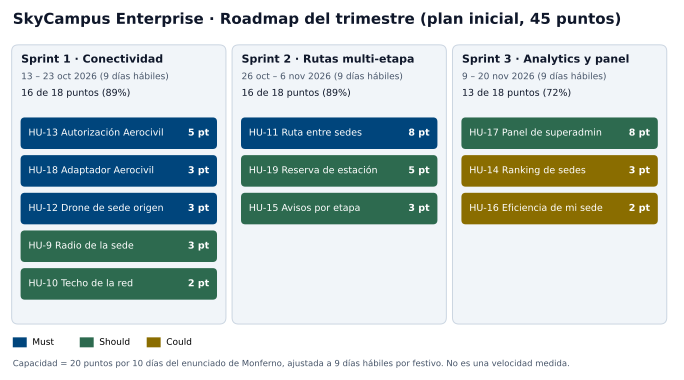
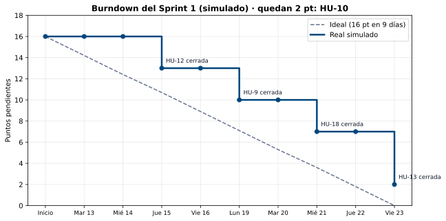
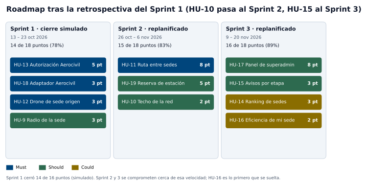

# Infernape · Reto 09 — Roadmap trimestral de SkyCampus Enterprise (3 sprints)
Estudiante: Julian Felipe Morales Zambrano

## Qué se pide

Planificar el trimestre de Enterprise en 3 sprints de 2 semanas (Sprint 1: conectividad multi-sede básica; Sprint 2: rutas multi-etapa y estaciones de carga; Sprint 3: analytics y panel de superadmin). Para cada sprint: historias seleccionadas, puntos totales y velocity estimada. Después, ejecutar la retrospectiva del Sprint 1 simulado: 3 cosas que salieron bien, 3 a mejorar y compromisos con responsable y fecha.

Los archivos de apoyo están en `docs/agil/`:

| Archivo | Para qué sirve |
|---|---|
| `roadmap-enterprise.csv` | El backlog del trimestre: historia, requisito, MoSCoW, puntos, sprint, responsable y dependencia |
| `roadmap-inicial.svg` | El roadmap del plan inicial |
| `burndown-sprint1.svg` | Burndown del Sprint 1 simulado |
| `roadmap-ajustado.svg` | El roadmap después de la retrospectiva |
| `JIRA-INFERNAPE09-COPIAR.md` | Textos para crear los sprints y las 3 historias nuevas en Jira |

## 1. Punto de partida: el backlog

El backlog sale del reto 06 de Infernape ([`INFERNAPE06-MATRIZ-TRAZABILIDAD.md`](INFERNAPE06-MATRIZ-TRAZABILIDAD.md)): ocho historias, HU-9 a HU-16, una por requisito funcional. Para que los tres temas que pide el enunciado tengan trabajo real, se agregan **tres historias nuevas** que salen de huecos que el propio repositorio reconoce:

| Historia | Texto | Por qué se agrega | MoSCoW |
|---|---|---|---|
| HU-17 | Como Superadmin, quiero un panel que muestre la red completa (sedes, estaciones y misiones activas) y me deje fijar el techo de radio, para supervisar toda la red desde un solo lugar. | El enunciado pide "un panel de superadmin para la red completa" y la matriz del reto 06 dice que ningún RF tiene todavía pantalla. | Should |
| HU-18 | Como Operador de drones, quiero que el sistema pregunte a la Aerocivil real y no despegue si no responde en 3 segundos, para que la falla segura funcione con el servicio de verdad y no solo con un doble de prueba. | RNF-10 está "verificado con el doble": el adaptador HTTP no existe y es quien debe aplicar el límite de 3 s (reto 06, sección 8). | Must |
| HU-19 | Como Operador de drones, quiero que cada parada de carga reserve una estación libre y que el paquete no espere más de 30 minutos, para que una ruta multi-etapa no deje paquetes olvidados. | SC-15 (reto 07) exige reservar la franja (RN-07) y el límite de 30 min (RN-02); el código solo asigna una parada fija de 20 min (`PlanificadorRutas.MINUTOS_DE_CARGA`) y no reserva nada. | Should |

HU-18 y HU-19 son trabajo técnico que el reto 06 ya dejó anotado como pendiente; HU-17 es una pantalla nueva. Las tres necesitan su requisito en la matriz si el revisor las quiere trazadas (queda en los límites, sección 9).

**Fuera del trimestre (Won't):** la integración con el ERP universitario y con la Plataforma de Analytics (flujos 19 a 21 del C4, ya marcados Won't en el reto 06), y la prioridad de las misiones urgentes en el código Enterprise (conflicto C-04 del reto 06, que sigue pendiente).

## 2. Calendario y velocity estimada

**Equipo supuesto: 3 personas** (Julian, Juan y María, los mismos nombres que usa Monferno 02). Si tu equipo es otro, solo cambian los nombres de la columna "Responsable".

| Sprint | Fechas | Días hábiles | Festivo |
|---|---|---|---|
| 1 | martes 13 al viernes 23 de octubre de 2026 | 9 | lunes 12 de octubre |
| 2 | lunes 26 de octubre al viernes 6 de noviembre | 9 | lunes 2 de noviembre |
| 3 | lunes 9 al viernes 20 de noviembre | 9 | lunes 16 de noviembre |

(Festivos de Colombia que caen en lunes; conviene confirmarlos con el calendario oficial.)

**Velocity estimada: 18 puntos por sprint.** No hay sprints reales medidos de Enterprise. La única referencia es la de Monferno: 20 puntos en un sprint de 10 días hábiles (dato del enunciado, tampoco medido), es decir 2 puntos por día. Con 9 días hábiles: 2 × 9 = **18 puntos**. Es una capacidad de partida; se corrige con la velocity real al cerrar el Sprint 1 (sección 8).

## 3. Estimación

Escala de Fibonacci (1, 2, 3, 5, 8). **Referencia: HU-13 = 5 puntos** (autorizar un vuelo con tres reglas que se cumplen a la vez: autorización, altura y radio efectivo). Las demás se comparan con ella.

| Historia | Puntos | Por qué |
|---|---|---|
| HU-10 | 2 | Un número con jerarquía fija (la Aerocivil manda sobre el superadmin); la regla ya está decidida en el reto 06. |
| HU-9 | 3 | Igual que HU-10 pero con más casos: el coordinador pide más de lo permitido y debe ver qué radio rige. |
| HU-12 | 3 | Asignar el drone de mayor batería de la sede de origen; la estrategia existe y solo cambia el repositorio por sede. |
| HU-18 | 3 | Cliente HTTP con límite de 3 s y traducción de errores a "no despega"; el puerto ya está definido. Se prueba con un servidor falso local porque no se conoce un entorno de pruebas de la Aerocivil. |
| HU-14 | 3 | Ordenar las sedes por tasa de éxito, entregas y nombre; el cálculo ya existe en `AnalyticsRed`, falta exponerlo. |
| HU-15 | 3 | Los observadores y los eventos de etapa existen (Infernape 03); falta publicar inicio, fin y fallo por etapa. |
| HU-16 | 2 | Misma operación que HU-14 filtrada a una sede, con "sin datos" en vez de cero. |
| HU-13 | 5 | **Referencia.** |
| HU-19 | 5 | Reservar franjas sin que dos paquetes tomen el mismo puesto y cumplir el límite de 30 min, con los flujos A4 y A5 de SC-15. Es estado compartido, que es lo que más se rompe. |
| HU-11 | 8 | La historia más grande: ruta directa o con paradas, tres criterios elegibles, autorización de cada etapa y rendimiento menor a 500 ms con 20 estaciones (RNF-08). Candidata a partirse si no cabe. |
| HU-17 | 8 | Pantalla nueva que junta datos de varios módulos y usa los design tokens del reto 08. Incertidumbre alta porque no hay ninguna pantalla hecha. |

Total: 3 + 2 + 8 + 3 + 5 + 3 + 3 + 2 + 8 + 3 + 5 = **45 puntos**.

Los puntos estiman la historia completa, tal como la vería el equipo al empezar el trimestre. El repositorio ya trae partes del dominio de los retos 03 a 06, por eso varias historias salen bajas; no se estimó "lo que falta" en cada una.

## 4. El roadmap: 3 sprints

El orden sale de dos reglas: primero lo Must, y nada entra antes de aquello de lo que depende.

### Sprint 1 — Conectividad multi-sede básica (16 de 18 puntos, 89 %)

**Meta:** dos sedes comparten flota bajo las reglas de la Aerocivil: el drone sale de la sede de origen y ningún vuelo despega sin autorización ni fuera del radio efectivo.

| Historia | Requisito | MoSCoW | Puntos | Responsable | Depende de |
|---|---|---|---|---|---|
| HU-13 | RF-16, RNF-09, RNF-10 | Must | 5 | Julian | HU-18 |
| HU-18 | RNF-10 | Must | 3 | Juan | — |
| HU-12 | RF-15 | Must | 3 | Juan | — |
| HU-9 | RF-12 | Should | 3 | María | — |
| HU-10 | RF-13 | Should | 2 | Julian | — |

**Velocity estimada:** 18 (capacidad) y **16 comprometidos**. Quedan 2 puntos libres porque es el primer sprint con el equipo y con una integración externa (HU-18).
**Review:** un vuelo ECI → UNAL se autoriza o se rechaza según la Aerocivil, y un coordinador que pide un radio mayor ve "configurado 15 km, efectivo 5 km".

### Sprint 2 — Rutas multi-etapa y estaciones de carga (16 de 18 puntos, 89 %)

**Meta:** un drone viaja de la ECI a la UNAL con una parada de carga en una estación, y cada etapa avisa su inicio, su fin o su fallo.

| Historia | Requisito | MoSCoW | Puntos | Responsable | Depende de |
|---|---|---|---|---|---|
| HU-11 | RF-14, RNF-08 | Must | 8 | Juan | HU-13 |
| HU-19 | SC-15 | Should | 5 | María | HU-11 |
| HU-15 | RF-18 | Should | 3 | Julian | HU-11 |

**Velocity estimada:** 18 y **16 comprometidos**. HU-19 y HU-15 arrancan cuando HU-11 tenga la ruta planificada; mientras tanto María diseña el modelo de reservas y Julian prepara los eventos.
**Review:** la ruta multi-etapa funcionando entre ECI y UNAL en el simulador, que es la demo que pide la tabla de ceremonias del reto.

### Sprint 3 — Analytics y panel de superadmin (13 de 18 puntos, 72 %)

**Meta:** el superadmin ve la red completa y el coordinador ve su sede.

| Historia | Requisito | MoSCoW | Puntos | Responsable | Depende de |
|---|---|---|---|---|---|
| HU-17 | nuevo | Should | 8 | María | HU-10 |
| HU-14 | RF-17 | Could | 3 | Julian | — |
| HU-16 | RF-19 | Could | 2 | Juan | — |

**Velocity estimada:** 18 y **13 comprometidos**. Se dejan 5 puntos libres a propósito: es el último sprint, absorbe lo que se atrase del Sprint 2 (el más riesgoso) y necesita tiempo para el cierre (JaCoCo, SonarQube y la matriz de trazabilidad en verde).
**Review:** el panel de superadmin con el ranking y el techo de radio, y la vista de eficiencia de una sede.

### Resumen

| Sprint | Historias | Puntos | Capacidad | Compromiso |
|---|---|---|---|---|
| 1 | HU-13, HU-18, HU-12, HU-9, HU-10 | 16 | 18 | 89 % |
| 2 | HU-11, HU-19, HU-15 | 16 | 18 | 89 % |
| 3 | HU-17, HU-14, HU-16 | 13 | 18 | 72 % |
| **Total** | 11 historias | **45** | 54 | 83 % |

La carga por persona queda entre 3 y 8 puntos por sprint; María es la menos cargada en el Sprint 1 porque su módulo (analytics y panel) entra después, y por eso además hace la revisión de PR y configura el tablero.

## 5. Ceremonias del trimestre

| Ceremonia | Cuándo | Duración | Qué se hace en SkyCampus Enterprise |
|---|---|---|---|
| Sprint Planning | primer día hábil de cada sprint | 3 h | Elegir historias del backlog, estimar, asignar por módulo (Julian: dominio y aplicación; Juan: rutas e infraestructura; María: analytics y panel) |
| Daily Scrum | todos los días | 15 min | ¿Qué hice? ¿Qué haré? ¿Impedimento? Una vez por persona |
| Sprint Review | último día, por la mañana | 2 h | La demo de cada sprint (sección 4) |
| Retrospectiva | último día, por la tarde | 1 h | 3 que salieron bien, 3 a mejorar, 3 compromisos con fecha |

## 6. Definition of Done (la del equipo v2, sin cambios)

Una historia de Enterprise está terminada solo si cumple la Definition of Done de Monferno ([`MONFERNO09-SPRINT1.md`](MONFERNO09-SPRINT1.md), sección 5): PR revisado, cobertura de 80 % o más (el build ya exige 85 % en líneas y ramas), SonarQube con 0 bugs y 0 vulnerabilidades, criterios Gherkin con prueba, merge a `develop` con GitFlow y documentos actualizados.

## 7. Retrospectiva del Sprint 1 (simulada)

> **Qué es real y qué es supuesto.** El Sprint 1 no se ejecutó: es un ejercicio simulado. Los hechos del proyecto que se mencionan (la matriz con claves de Jira pendientes, el adaptador de la Aerocivil que no existe, la regla de precedencia, las pruebas que protegen la matriz) son reales y salen del repositorio. Lo que se supone es el resultado del sprint: qué historias cerraron, en qué día y cuántos puntos.

### Resultado del sprint

- **Comprometido:** 16 puntos. **Cerrado:** 14 puntos (HU-13, HU-18, HU-12 y HU-9). **Sin cerrar:** HU-10 (2 puntos, Should), que pasa al Sprint 2.
- **Velocity real del Sprint 1: 14** (la estimada era 18 de capacidad).
- **Por qué quedó HU-10 y no otra:** era la de menor prioridad (Should) y la más fácil de mover; cuando HU-18 y HU-13 se alargaron, el equipo protegió los Must.

| Día | Fecha | Ideal | Real | Lo que pasó |
|---|---|---|---|---|
| 0 | inicio | 16,0 | 16 | |
| 1 | mar 13 | 14,2 | 16 | |
| 2 | mié 14 | 12,4 | 16 | |
| 3 | jue 15 | 10,7 | 13 | HU-12 cerrada |
| 4 | vie 16 | 8,9 | 13 | |
| 5 | lun 19 | 7,1 | 10 | HU-9 cerrada |
| 6 | mar 20 | 5,3 | 10 | |
| 7 | mié 21 | 3,6 | 7 | HU-18 cerrada |
| 8 | jue 22 | 1,8 | 7 | |
| 9 | vie 23 | 0,0 | 2 | HU-13 cerrada; queda HU-10 |

**Qué se lee en la gráfica:** la línea real queda por encima de la ideal casi todo el sprint y cae en escalones. HU-13 (5 puntos) se cierra el último día. Es el patrón de historias grandes que no se parten en trabajo diario.

### Qué salió bien

1. **La regla de precedencia se decidió antes de programar.** "Aerocivil > superadmin > coordinador" quedó escrita en el reto 06 (conflictos C-01 y C-02), así que HU-9, HU-10 y HU-13 se implementaron sin discutir quién gana y sin rehacer nada.
2. **Las pruebas protegen la trazabilidad.** `MatrizTrazabilidadTest` hace fallar el build si una prueba de la matriz se borra o se renombra, así que al cerrar el sprint la pregunta "¿cada requisito tiene prueba?" la contesta el build y no una revisión manual. El Quality Gate de 85 % se mantuvo.
3. **El dominio quedó aislado, y eso hizo barata la integración.** Como el dominio no depende de frameworks (RNF-11, verificado por `ArquitecturaCapasTest`) y la Aerocivil es un puerto (`ServicioAerocivil`), HU-18 agregó el adaptador HTTP sin tocar las reglas de HU-13.

### Qué mejorar

1. **Las historias grandes cierran tarde.** El burndown estuvo plano los 2 primeros días y HU-13 cerró el último día. Cuando algo falla, ya no queda tiempo para corregir.
2. **HU-13 y HU-18 se estimaron como si fueran independientes y no lo eran.** El límite de 3 s de RNF-10 vive en el adaptador, así que HU-13 no se podía dar por terminada sin HU-18. Además no se conoce un entorno de pruebas de la Aerocivil, y eso no se discutió en el Planning.
3. **El tablero y la matriz quedaron desfasados.** La matriz del reto 06 todavía tiene `[PEGA: clave]` en las historias, y el tablero de Jira no refleja los sprints ni las tres historias nuevas.

### Compromisos

| # | Compromiso | Responsable | Fecha límite | Cómo se sabe que se cumplió |
|---|---|---|---|---|
| 1 | Partir toda historia de 5 puntos o más en subtareas de máximo 1 día y mover el tablero antes del Daily | Julian | lunes 26 de octubre (Planning del Sprint 2) | HU-11 llega al Planning con subtareas de 1 día o menos |
| 2 | Escribir el contrato de la Aerocivil (campos, errores y tiempo de espera) y una prueba de contrato con servidor falso, y estimar juntas las historias que dependen de un servicio externo | Juan | miércoles 28 de octubre | El contrato está en `docs/` y la prueba corre en `mvn verify` |
| 3 | Pegar las claves de Jira en la matriz, crear los sprints y las historias HU-17 a HU-19 con la guía `JIRA-INFERNAPE09-COPIAR.md` | María | viernes 30 de octubre | La matriz ya no tiene `[PEGA: clave]` y el tablero muestra el Sprint 2 activo |

## 8. Ajuste del roadmap después de la retrospectiva

Con la velocity real de 14 (no la capacidad de 18), el plan se corrige así:

| Cambio | Razón |
|---|---|
| HU-10 pasa del Sprint 1 al Sprint 2 | Quedó sin cerrar |
| HU-15 pasa del Sprint 2 al Sprint 3 | Hace que el Sprint 2 salga en 15 puntos, cerca de la velocity real; depende de HU-11, así que de todas formas empezaba tarde |

| Sprint | Historias | Puntos | Contra velocity 14 |
|---|---|---|---|
| 1 (cierre real) | HU-13, HU-18, HU-12, HU-9 | 14 | 100 % |
| 2 | HU-11, HU-19, HU-10 | 15 | 107 % |
| 3 | HU-17, HU-15, HU-14, HU-16 | 16 | 114 % |

El total sigue en 45 puntos. Para el Sprint 3 el plan se pasa 2 puntos de la velocity de 14: **HU-16 (Could, 2 puntos) es lo primero que se suelta**; si el Sprint 2 también cierra en 14, el Sprint 3 queda exactamente en 14. HU-14 (Could) es lo siguiente. HU-17 no se toca porque es el tema del sprint.

## 9. Límites

- **La velocity de 18 no se midió.** Viene de la referencia de Monferno (20 puntos en 10 días, dato del enunciado) ajustada por festivos; la de 14 es simulada.
- **El Sprint 1 es simulado.** Los días y los puntos cerrados son supuestos. Lo único real son los hechos del repositorio citados en la retrospectiva.
- **HU-17, HU-18 y HU-19 no están en la matriz del reto 06.** Si el revisor exige trazabilidad completa, habría que agregarles requisito (por ejemplo RF-20 para el panel) y caso de uso; no se hizo para no tocar la matriz ya entregada.
- **El equipo de 3 personas y la asignación por módulo son una suposición.**
- **El tablero de Jira lo crea quien tenga acceso:** este documento da el contenido; los textos están listos en `JIRA-INFERNAPE09-COPIAR.md`.
- **Los festivos** de octubre y noviembre de 2026 están tomados del calendario colombiano de lunes festivos; conviene confirmarlos.
