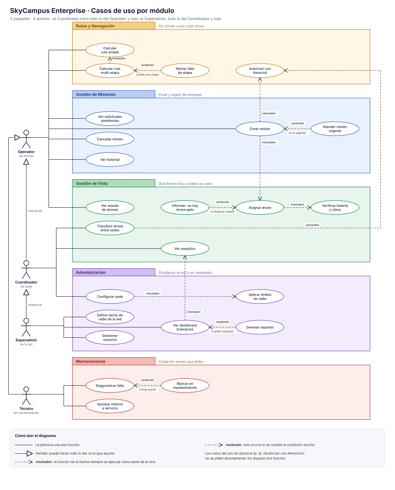

# Infernape · Casos de uso de SkyCampus Enterprise organizados en paquetes por módulo

Archivos: [`casos-de-uso-enterprise.svg`](uc/casos-de-uso-enterprise.svg) y [`casos-de-uso-enterprise.png`](uc/casos-de-uso-enterprise.png).

## 1. Qué se pide
Pasar del diagrama único (Chimchar) a 5 paquetes por módulo, con herencia de actores (Coordinador de sede extiende Operador, Superadmin extiende Coordinador), todos los `include` y `extend` justificados y un diagrama que entienda un rector sin conocimientos técnicos.

## 2. Actores y herencia
| Actor | Hereda de | Casos propios |
|---|---|---|
| Operador de drones | — | Ver solicitudes pendientes, Crear misión, Cancelar misión, Ver historial, Ver estado de drones, Calcular ruta simple, Calcular ruta multi-etapa |
| Coordinador de sede | Operador | Transferir drone entre sedes, Ver analytics, Configurar sede |
| Superadmin | Coordinador | Gestionar usuarios, Definir techo de radio de la red, Ver dashboard Enterprise |
| Técnico de mantenimiento | Operador (como en la v2) | Diagnosticar fallo, Aprobar retorno a servicio |

Como la herencia es completa, el Superadmin también hace todo lo del Coordinador y el Operador sin dibujar esas líneas otra vez. Así se respeta la jerarquía de RF-12/RF-13 (Aerocivil > superadmin > coordinador).

## 3. Los 5 paquetes
| Paquete | Casos de uso |
|---|---|
| Gestión de Misiones | Ver solicitudes pendientes, Crear misión, Cancelar misión, Ver historial, *Atender misión urgente* |
| Gestión de Flota | Ver estado de drones, Asignar drone, Transferir drone entre sedes, Ver analytics, *Verificar batería y clima*, *Informar: no hay drone apto* |
| Rutas y Navegación | Calcular ruta simple, Calcular ruta multi-etapa, Autorizar con Aerocivil, *Alertar fallo de etapa* |
| Mantenimiento | Diagnosticar fallo, Marcar en mantenimiento, Aprobar retorno a servicio |
| Administración | Configurar sede, Gestionar usuarios, Ver dashboard Enterprise, Generar reportes, *Definir techo de radio de la red*, *Aplicar límites de radio* |

En cursiva, los 6 casos que añadí a los 18 del enunciado para poder justificar include/extend y cubrir RF-13 (techo de red), RF-15, RF-16 y RF-18.

## 4. `<<include>>` (siempre ocurre; la flecha va del caso base al incluido)
| Base → Incluido | Justificación |
|---|---|
| Crear misión → Asignar drone | Una misión no existe sin drone (RF-15, SC-11). |
| Crear misión → Autorizar con Aerocivil | Ningún vuelo entre sedes despega sin autorización, ni los urgentes (RF-16, RNF-09, RNF-10). |
| Transferir drone entre sedes → Autorizar con Aerocivil | Mover un drone entre sedes es un vuelo entre sedes: misma regla RF-16. |
| Asignar drone → Verificar batería y clima | Siempre se descartan drones con menos de 30 % y se consulta el clima (RF-15). |
| Calcular ruta multi-etapa → Calcular ruta simple | Una ruta multi-etapa es una cadena de tramos simples (Composite, SC-15, RF-14). |
| Configurar sede → Aplicar límites de radio | El radio que rige es siempre el menor entre coordinador, red y Aerocivil (RF-12, C-01, C-02). |
| Ver dashboard Enterprise → Ver analytics | El dashboard de la red se arma con las métricas por sede (RF-17, RF-19). |

## 5. `<<extend>>` (opcional, con condición; la flecha va del caso que extiende al base)
| Extiende → Base | Condición | Justificación |
|---|---|---|
| Atender misión urgente → Crear misión | Si la solicitud es urgente | Solo cambia el drone y el orden; nunca se salta la autorización (C-03). |
| Informar: no hay drone apto → Asignar drone | Si ningún drone cumple | Camino excepcional; si fuera include se ejecutaría siempre. |
| Alertar fallo de etapa → Calcular ruta multi-etapa | Si falla una etapa | Aviso de fallo y detención de la ruta (RF-18). |
| Generar reportes → Ver dashboard Enterprise | Si el usuario pide exportar | Mirar el panel no obliga a generar un reporte. |
| Marcar en mantenimiento → Diagnosticar fallo | Si se confirma avería | Un diagnóstico puede terminar sin avería. |

## 6. Decisiones de diseño (para el rector)
- **Una idea por paquete**, con un subtítulo en lenguaje llano ("Por dónde vuela cada drone", "Cuidar los drones que fallan"). Colores distintos por módulo.
- **Nombres de funciones en verbos del negocio**, sin términos técnicos; los estereotipos `«include»`/`«extend»` van con una leyenda en lenguaje llano y las condiciones escritas en la flecha ("si es urgente").
- **Las flechas cruzan paquetes solo donde el negocio lo exige** (crear misión → asignar drone → autorización). Hay un único cruce entre flechas punteadas (dashboard → analytics sobre configurar sede → límites), que no se pudo evitar sin separar los módulos.
- **Aerocivil, clima y ERP no se dibujan como actores**, igual que en el CU de la v2: están en el diagrama de contexto (C4) y aquí se llaman desde dentro de los casos de uso.
- **Autorizar con Aerocivil no tiene actor**: lo dispara el sistema (SC-12), por eso solo aparece como incluido.
- **Técnico hereda de Operador** como en la v2; si el equipo no quiere que el técnico pueda crear misiones, debe ser un actor independiente.
- **Pendiente de código:** `Transferir drone entre sedes`, `Gestionar usuarios`, `Generar reportes` y la distinción de urgencia en Enterprise no existen aún en `src/`; el diagrama modela lo pedido, no solo lo construido.
