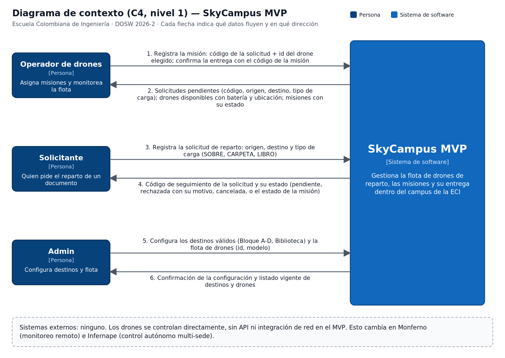
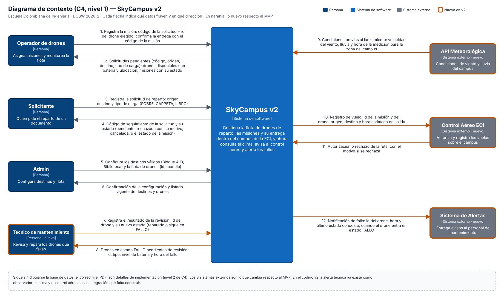

# Monferno · Reto 05 — Diagrama de contexto C4 (nivel 1): del MVP a SkyCampus v2

Las dos versiones están en este mismo documento para compararlas.

## 1. SkyCampus MVP (sin sistemas externos)

Detalle del MVP en [`RETO05-CONTEXTO-C4.md`](RETO05-CONTEXTO-C4.md).

## 2. SkyCampus v2 (con el Técnico y tres sistemas externos)

Archivos: [`contexto-skycampus-v2.drawio`](c4/contexto-skycampus-v2.drawio) (editable en app.diagrams.net), [`contexto-skycampus-v2.svg`](c4/contexto-skycampus-v2.svg) y [`contexto-skycampus-v2.png`](c4/contexto-skycampus-v2.png). En naranja, lo nuevo respecto al MVP.

### Actores y sistemas
| Elemento | Tipo | Qué hace | ¿Nuevo? |
|---|---|---|---|
| Operador de drones | Persona | Asigna misiones y monitorea la flota | No |
| Solicitante | Persona | Pide el reparto de un documento | No |
| Admin | Persona | Configura destinos y flota | No |
| Técnico de mantenimiento | Persona | Revisa y repara los drones que entran en FALLO | **Sí** |
| SkyCampus v2 | Sistema de software | Gestiona flota, misiones y entregas; consulta el clima, avisa al control aéreo y alerta los fallos | Evoluciona del MVP |
| API Meteorológica | Sistema externo | Entrega las condiciones de viento y lluvia | **Sí** |
| Control Aéreo ECI | Sistema externo | Registra y autoriza los vuelos sobre el campus | **Sí** |
| Sistema de Alertas | Sistema externo | Entrega avisos al personal de mantenimiento | **Sí** |

### Flujos de datos (qué viaja y en qué dirección)
| # | Dirección | Datos | ¿Nuevo? |
|---|---|---|---|
| 1 | Operador → SkyCampus | Código de la solicitud elegida + id del drone elegido; al confirmar la entrega, código de la misión | No |
| 2 | SkyCampus → Operador | Solicitudes pendientes, drones disponibles con batería y ubicación, misiones con su estado | No |
| 3 | Solicitante → SkyCampus | Origen, destino y tipo de carga (SOBRE, CARPETA, LIBRO) | No |
| 4 | SkyCampus → Solicitante | Código de seguimiento y estado de la solicitud | No |
| 5 | Admin → SkyCampus | Destinos válidos (Bloque A-D, Biblioteca) y flota (id, modelo) | No |
| 6 | SkyCampus → Admin | Confirmación y listado vigente de destinos y drones | No |
| 7 | Técnico → SkyCampus | Resultado de la revisión: id del drone y nuevo estado (reparado o sigue en FALLO) | **Sí** |
| 8 | SkyCampus → Técnico | Drones en FALLO pendientes de revisión: id, tipo, batería y hora del fallo | **Sí** |
| 9 | API Meteorológica → SkyCampus | Velocidad del viento, lluvia y hora de la medición, antes de lanzar | **Sí** |
| 10 | SkyCampus → Control Aéreo ECI | Registro de vuelo: id de misión y de drone, origen, destino y hora estimada de salida | **Sí** |
| 11 | Control Aéreo ECI → SkyCampus | Autorización o rechazo de la ruta, con el motivo si se rechaza | **Sí** |
| 12 | SkyCampus → Sistema de Alertas | Notificación de fallo: id del drone, hora y último estado conocido, cuando entra en FALLO | **Sí** |

## 3. ¿Qué creció?
- **Actores:** de 3 a 4 (el Técnico de mantenimiento).
- **Sistemas externos:** de 0 a 3. Es el cambio de fondo: el MVP no hablaba con nadie fuera de las personas.
- **Flujos:** de 6 a 12. Los 6 nuevos son 2 con el Técnico y 4 con los sistemas externos.
- **Condiciones para volar:** antes un drone salía si estaba disponible y con batería. Ahora además depende del clima (flecha 9) y de la autorización del Control Aéreo (flecha 11).

## 4. ¿Qué se mantuvo?
- Los 3 actores originales y sus 6 flujos (1 a 6), con los mismos datos.
- El propósito del sistema: gestionar la flota, las misiones y su entrega dentro del campus.
- El límite del diagrama: sigue sin dibujarse la base de datos, el correo ni el PDF. Son detalles de implementación (nivel 2 de C4) y en el código son interfaces con implementaciones intercambiables.
- Quién registra qué: el Solicitante registra la solicitud y el Operador registra la misión.

## 5. Supuestos y decisiones
- **Dirección de las flechas con sistemas externos.** El enunciado usa `←` y `↔` en una lista. Lo leí así: la API Meteorológica **entrega** datos a SkyCampus (flecha 9); el Control Aéreo es de **doble vía** (registro de vuelo hacia afuera, autorización hacia adentro); el Sistema de Alertas **recibe** la notificación de SkyCampus (flecha 12).
- **Consulta al clima.** La flecha 9 muestra los datos que viajan hacia SkyCampus. Que SkyCampus los pida con la ubicación del campus es parte de esa misma interacción, así que no dibujé una flecha extra de ida.
- **Cómo se entera el Técnico.** El Sistema de Alertas es quien le entrega el aviso fuera del límite del sistema, por eso no hay flecha entre el Sistema de Alertas y el Técnico. Dentro de SkyCampus, el Técnico consulta los drones en FALLO (flecha 8) y registra el resultado de la revisión (flecha 7). Esos dos flujos son una decisión mía, el enunciado solo dice que el actor es nuevo.
- **Rechazos por clima o por control aéreo.** Se le muestran al Operador por la flecha 2 existente (misiones con su estado), sin una flecha nueva.
- **Qué está construido.** El diagrama es la arquitectura objetivo. En el código v2, la alerta técnica ya existe como observador (`AlertaTecnico`, Monferno 03), pero todavía no hay integración con el clima ni con el Control Aéreo; son la parte que falta construir.

## Cómo editarlo
Abre `docs/c4/contexto-skycampus-v2.drawio` en [app.diagrams.net](https://app.diagrams.net) (Archivo → Abrir desde → Dispositivo) y exporta con Archivo → Exportar como → PNG o SVG.
