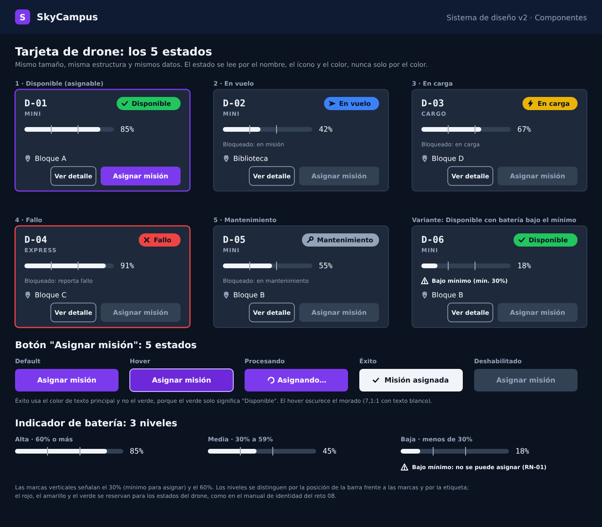

# Monferno · Reto 08 — Sistema de diseño de SkyCampus v2 y Leyes UX

Parte del manual de identidad del reto 08 de Chimchar ([`RETO08-MANUAL-IDENTIDAD.md`](RETO08-MANUAL-IDENTIDAD.md)): los colores, la tipografía y el tono no cambian. Aquí se convierten en componentes con todos sus estados y se aplican a un flujo de tres pantallas.

Archivos de este reto: [`tarjeta-drone-estados`](ux/v2/tarjeta-drone-estados.svg), [`flujo-1-panel-flota`](ux/v2/flujo-1-panel-flota.svg), [`flujo-2-detalle-mision`](ux/v2/flujo-2-detalle-mision.svg) y [`flujo-3-confirmacion`](ux/v2/flujo-3-confirmacion.svg), cada uno en `.svg` y `.png` dentro de `docs/ux/v2/`.

## 1. Tarjeta de drone

**Qué muestra, siempre en el mismo orden:** id (fuente monoespaciada), tipo (MINI, CARGO o EXPRESS), chip de estado, barra de batería con su porcentaje y las marcas del 30 % y el 60 %, ubicación, y los botones "Ver detalle" y "Asignar misión".

### Los 5 estados

| Estado | Color del chip | Ícono | Qué cambia en la tarjeta | "Asignar misión" |
|---|---|---|---|---|
| Disponible | Verde `#22C55E` | Marca de verificación | Nada más; es la tarjeta base | Habilitado si la batería es de 30 % o más |
| En vuelo | Azul `#3B82F6` | Flecha | Texto "Bloqueado: en misión" | Deshabilitado |
| En carga | Amarillo `#EAB308` | Rayo | Texto "Bloqueado: en carga" | Deshabilitado |
| Fallo | Rojo `#EF4444` | Equis | Borde rojo en toda la tarjeta y texto "Bloqueado: reporta fallo" | Deshabilitado |
| Mantenimiento | Gris `#94A3B8` | Llave | Texto "Bloqueado: en mantenimiento" | Deshabilitado |

Un drone Disponible con menos de 30 % de batería (variante D-06) conserva el chip verde, pero muestra el triángulo "Bajo mínimo (mín. 30%)" y su botón queda deshabilitado, como en el manual del reto 08: "Disponible" dice que está libre, no que se pueda asignar.

**Cada estado se identifica por tres señales:** el nombre en texto, un ícono distinto y el color. El color nunca va solo. Cada botón deshabilitado dice la razón en la misma tarjeta.

**Contraste del texto del chip (`#0B1220`) sobre su color:** Disponible 8,22:1, En vuelo 5,09:1, En carga 9,76:1, Fallo 4,98:1 (cifras del manual del reto 08) y Mantenimiento 7,30:1.

### Diferencia con el modelo actual
El enum `EstadoDrone` del código v2 tiene DISPONIBLE, EN_VUELO, ATERRIZANDO y FALLO. La tarjeta pide 5 estados, así que:
- **En carga y Mantenimiento no existen en el modelo.** Hace falta agregarlos antes de implementar esta tarjeta.
- **ATERRIZANDO no tiene tarjeta propia.** Propongo mostrarlo como En vuelo hasta que aterrice, porque el drone sigue ocupado; es una decisión a confirmar.

## 2. Botón "Asignar misión" y indicador de batería

| Botón | Aspecto |
|---|---|
| Default | Fondo morado `#7C3AED`, texto blanco (5,70:1) |
| Hover | Morado más oscuro `#6D28D9` con borde claro (7,10:1) |
| Procesando | Mismo morado, ícono giratorio y el texto "Asignando…" |
| Éxito | Fondo `#F1F5F9`, texto oscuro y marca de verificación: "Misión asignada" |
| Deshabilitado | Fondo `#334155`, texto `#94A3B8` (4,04:1, como en el manual) |

| Batería | Cómo se ve |
|---|---|
| Alta, 60 % o más | Barra por encima de las dos marcas |
| Media, 30 % a 59 % | Barra entre las dos marcas |
| Baja, menos de 30 % | Barra bajo la marca del 30 %, triángulo de advertencia y "Bajo mínimo" |

### Dos decisiones que se apartan del enunciado
1. **El indicador de batería no usa verde, amarillo y rojo.** El enunciado los pide, pero en el manual del reto 08 esos tres colores ya significan Disponible, En carga y Fallo ("un color, un significado"). Una barra verde dentro de una tarjeta En carga o roja dentro de una tarjeta Disponible se leería como un estado. Los tres niveles se mantienen con los mismos umbrales, distinguidos por las marcas de 30 % y 60 %, la etiqueta y, en el nivel bajo, el triángulo. Si el revisor prefiere los colores literales, el cambio es de una línea en el relleno de la barra, a costa de ese choque.
2. **El botón de éxito no es verde**, por la misma razón: el verde solo significa Disponible.

## 3. Flujo de asignación automática (3 pantallas)

| Pantalla | Qué hace el operador | Qué ve |
|---|---|---|
| 1. Panel de flota | Revisa la solicitud pendiente y pulsa "Asignar automáticamente" | La solicitud SOL-014 con la estrategia activa, los drones Disponibles abiertos y los demás estados agrupados y cerrados, las alertas sin confirmar y el botón de emergencia |
| 2. Detalle de misión | Revisa la propuesta del sistema y pulsa "Confirmar asignación" | La solicitud, el drone propuesto en su tarjeta, la estrategia de selección (3 opciones, una marcada) y 4 comprobaciones: clima, batería, capacidad y disponibilidad |
| 3. Confirmación | Pulsa "Volver al panel" o "Ver misión" | "Misión M-014 asignada", el drone ya En vuelo, el estado de la solicitud ATENDIDA y a quién se avisó (panel y registro) |

Corresponde al caso SC-07 ([`MONFERNO07-SC07-ASIGNACION-AUTOMATICA.md`](MONFERNO07-SC07-ASIGNACION-AUTOMATICA.md)): la pantalla 2 muestra los resultados de los pasos 3, 4 y 6 (clima, filtro y validación final) y la 3 los de los pasos 7 a 9 (asignar, notificar y atender la solicitud). Los datos del flujo (SOL-014, M-014, D-01) son ilustrativos.

## 4. Leyes UX aplicadas

### Ley de Fitts (cuanto más grande y más cerca, más rápido se alcanza)
- **Emergencia siempre a mano.** "Cancelar misión en vuelo" mide 308 × 78 px, está fija en la esquina inferior derecha de la pantalla 1 y no está dentro de ningún menú. Una esquina de pantalla es el objetivo más fácil de alcanzar: el puntero se detiene solo en el borde.
- **Tamaño según importancia.** Las acciones que cierran un paso son las más grandes: "Confirmar asignación" y "Volver al panel" miden 300 × 80 px; "Asignar automáticamente", 232 × 48 px; los botones dentro de una tarjeta, 170 × 40 px.
- **Misma posición para confirmar.** En las pantallas 2 y 3 la acción principal está en el mismo lugar (esquina inferior derecha), así que el puntero no se desplaza entre un paso y el siguiente. En la pantalla 1 la acción principal va dentro de la franja de la solicitud porque actúa sobre ella; la esquina inferior derecha se deja para la emergencia.
- **Acciones peligrosas lejos de las comunes.** El botón de emergencia queda separado de "Asignar misión" y tiene otro aspecto para no confundirse.
- **Límite:** los botones de las tarjetas (40 px de alto) quedan por debajo de los 44 px que se recomiendan para uso táctil. Es un panel de sala de control con mouse; si se usara en tableta habría que agrandarlos.

### Ley de Hick (más opciones a la vez, más tiempo para decidir)
- **Agrupar por estado en vez de una lista plana.** La flota de 7 drones del ejemplo se divide en 5 grupos con su cantidad. Solo está abierto "Disponibles", que es donde el operador puede actuar: ve 3 tarjetas, no 7, y con 20 drones seguiría viendo solo los que puede asignar.
- **Lo demás, a un clic.** Los grupos En vuelo, En carga, Fallo y Mantenimiento muestran su cantidad pero siguen cerrados.
- **Pocas opciones y una por defecto.** La estrategia de selección ofrece 3 opciones, con "Mayor batería" ya marcada, así que el caso normal no exige decidir.
- **Una decisión por pantalla.** Cada paso tiene una sola acción principal.
- **La automatización reduce la elección.** En el MVP el operador comparaba los drones y elegía uno; en el flujo v2 solo confirma o rechaza la propuesta.

### Número de Miller (aprox. 7 elementos en la memoria de trabajo)
La bandeja de alertas de la pantalla 1 muestra "2 de 7" y tiene el botón "Confirmar todas". Decisión mía: al llegar a 7 sin confirmar, el panel pide confirmar antes de mostrar una nueva. Las alertas de Fallo no se descartan nunca.

## 5. Supuestos y límites
- **Fuentes del render:** las imágenes usan DejaVu Sans y DejaVu Sans Mono como sustitutas, porque Inter y JetBrains Mono no estaban instaladas. La aplicación usa las del manual.
- **Datos ilustrativos:** los ids, las baterías y las ubicaciones de las imágenes no vienen del sistema.
- **Diseño estático:** son imágenes SVG y PNG; no hay prototipo interactivo. Los estados hover y procesando se muestran como variantes del botón.
- **El enunciado indica D-XX** como formato del id y las mismas ubicaciones del campus que en el manual del reto 08.
