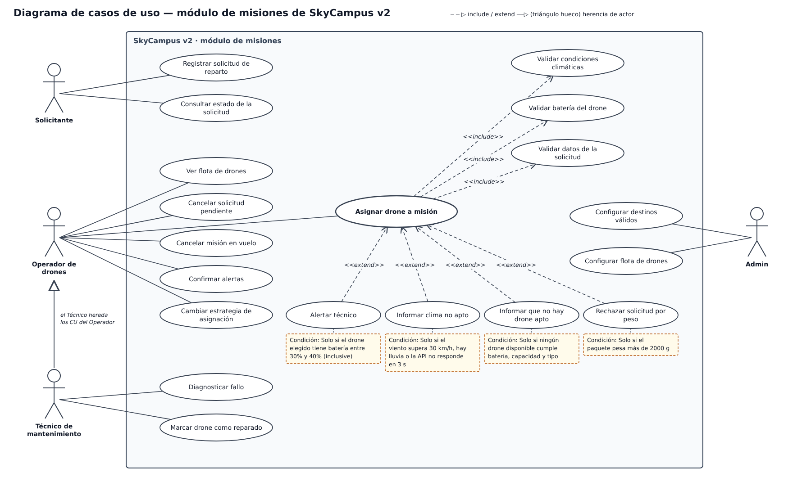

# Monferno · Reto 10 — Casos de uso del módulo de misiones de SkyCampus v2

Archivos: [`casos-de-uso-v2.drawio`](uc/casos-de-uso-v2.drawio) (editable en app.diagrams.net), [`casos-de-uso-v2.svg`](uc/casos-de-uso-v2.svg) y [`casos-de-uso-v2.png`](uc/casos-de-uso-v2.png).

## 1. Actores
| Actor | Relación | Casos de uso propios |
|---|---|---|
| Solicitante | — | Registrar solicitud de reparto; Consultar estado de la solicitud |
| Operador de drones | — | Ver flota de drones; Cancelar solicitud pendiente; Cancelar misión en vuelo; Confirmar alertas; Cambiar estrategia de asignación; Asignar drone a misión |
| Técnico de mantenimiento | Hereda del Operador | Diagnosticar fallo; Marcar drone como reparado |
| Admin | — | Configurar destinos válidos; Configurar flota de drones |

## 2. Herencia de actores
El Técnico es un Operador especializado (flecha con triángulo hueco hacia el Operador). Por eso el diagrama **no repite** los seis casos de uso del Operador en el Técnico: los hereda, y solo se dibujan sus dos casos exclusivos, *Diagnosticar fallo* y *Marcar drone como reparado*.

Consecuencia que conviene tener presente: la herencia en UML es completa, así que el Técnico también puede asignar drones, cancelar misiones y cambiar la estrategia. Si el equipo no quiere eso, la herencia no sirve y el Técnico debe ser un actor independiente. Se deja como está porque es lo que pide el enunciado.

## 3. Relaciones `<<include>>` (obligatorias, siempre se ejecutan)
La flecha va del caso base al incluido.

| Caso base | Caso incluido | Por qué es obligatorio |
|---|---|---|
| Asignar drone a misión | Validar condiciones climáticas | Ninguna misión puede asignarse sin consultar el clima (consulta a la API Meteorológica) |
| Asignar drone a misión | Validar batería del drone | El drone elegido debe tener al menos el 30 % de batería (RN-01) |
| Asignar drone a misión | Validar datos de la solicitud | Destino válido, peso y prioridad deben estar completos antes de buscar drone |

## 4. Relaciones `<<extend>>` (opcionales, con condición)
La flecha va del caso que extiende hacia el caso base. Cada una solo ocurre si se cumple su condición.

| Caso que extiende | Caso base | Condición |
|---|---|---|
| Alertar técnico | Asignar drone a misión | Solo si el drone elegido tiene batería entre 30 % y 40 % (inclusive) |
| Informar clima no apto | Asignar drone a misión | Solo si el viento supera 30 km/h, hay lluvia o la API no responde en 3 s |
| Informar que no hay drone apto | Asignar drone a misión | Solo si ningún drone disponible cumple batería, capacidad y tipo |
| Rechazar solicitud por peso | Asignar drone a misión | Solo si el paquete pesa más de 2000 g |

## 5. Decisiones y supuestos
- **Alcance:** solo el módulo de misiones. Las consultas de fondo (alerta de fallo automática, registro de eventos) se modelan como parte de los casos de uso, no como casos de uso del actor.
- **Sistemas externos:** la API Meteorológica, el Control Aéreo y el Sistema de Alertas no se dibujan como actores porque el diagrama de contexto del reto 05 ya los muestra y aquí se llaman desde dentro de los casos de uso.
- **Rango 30–40 %:** el drone ya cumple el mínimo de 30 % (por eso se puede asignar), pero queda justo; el extend avisa al técnico antes de que baje del mínimo. Si la batería es mayor a 40 % no pasa nada, y menor a 30 % ni siquiera se elige (entra por *Informar que no hay drone apto*).
- **Extend y no include en los avisos:** *Informar clima no apto* y *Informar que no hay drone apto* son caminos excepcionales de *Asignar drone a misión*; si fueran include se ejecutarían siempre.
- **Cancelar misión en vuelo** pertenece al Operador porque es la acción de emergencia del reto 08.
- **Pendiente de código:** el estado de drone usado en *Marcar drone como reparado* (paso de FALLO a DISPONIBLE, sin pasar por MANTENIMIENTO) debe revisarse cuando se amplíe `EstadoDrone`.
