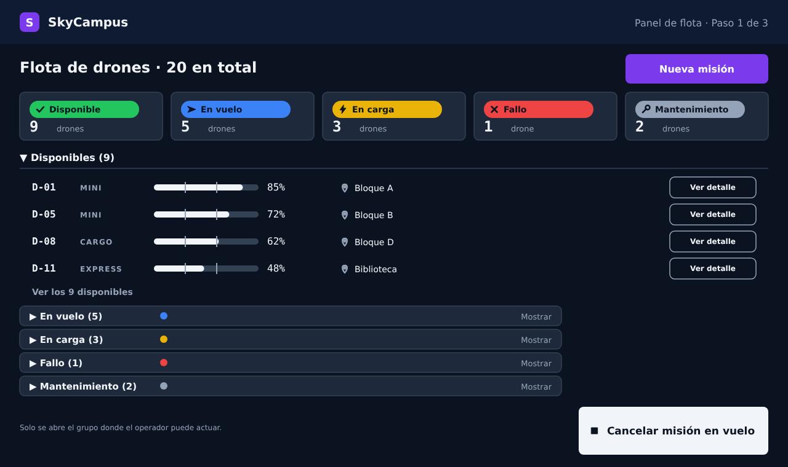
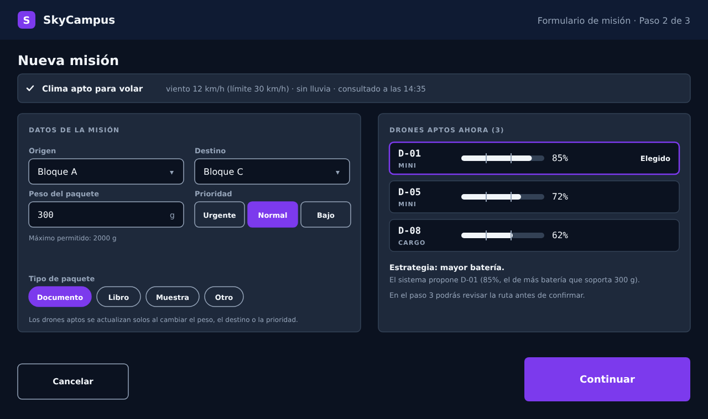
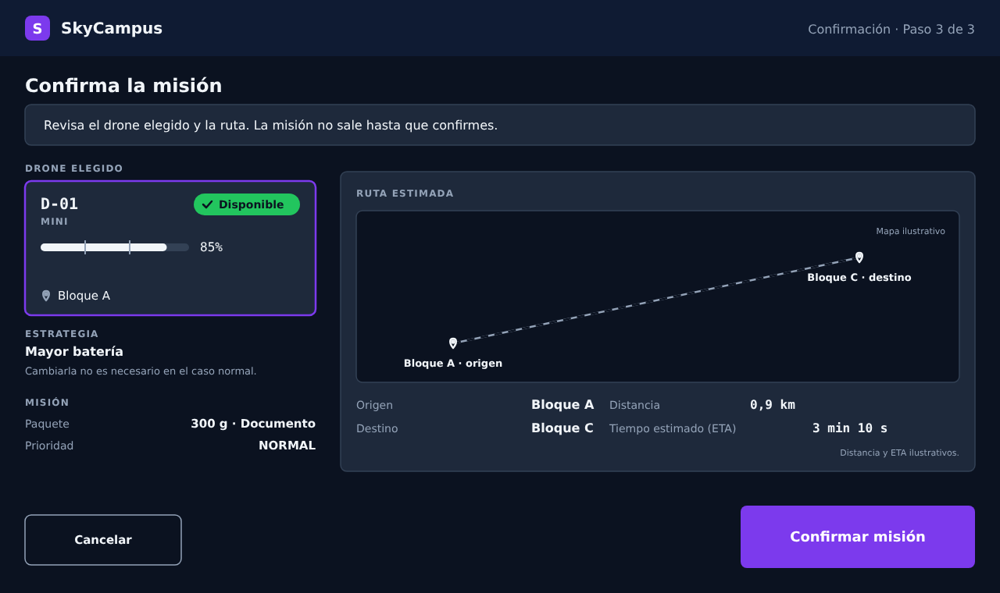
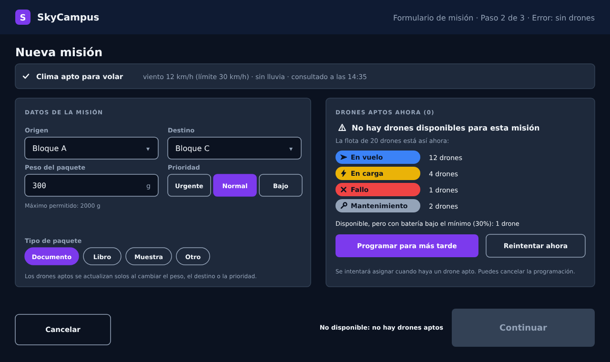
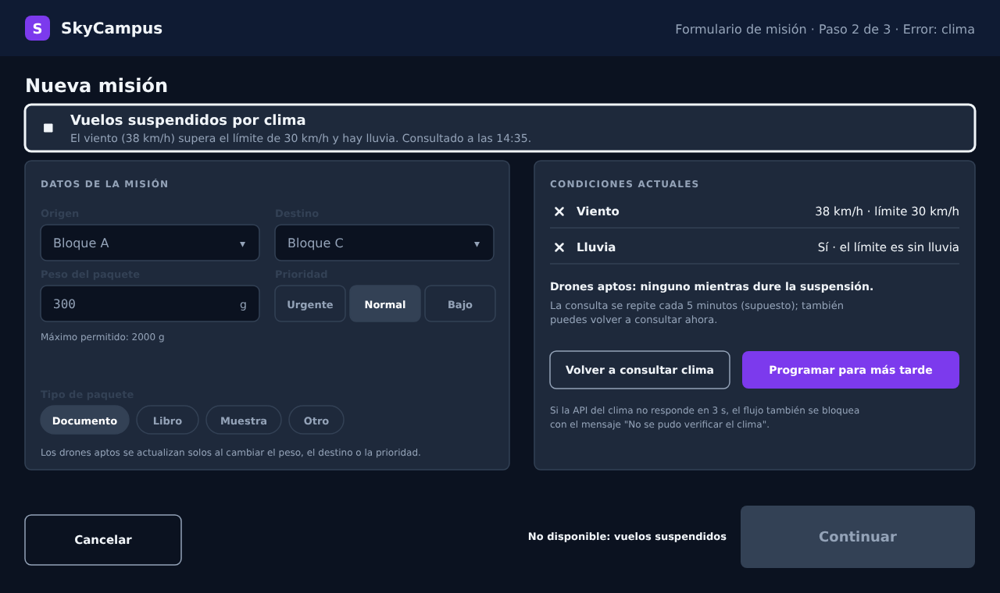
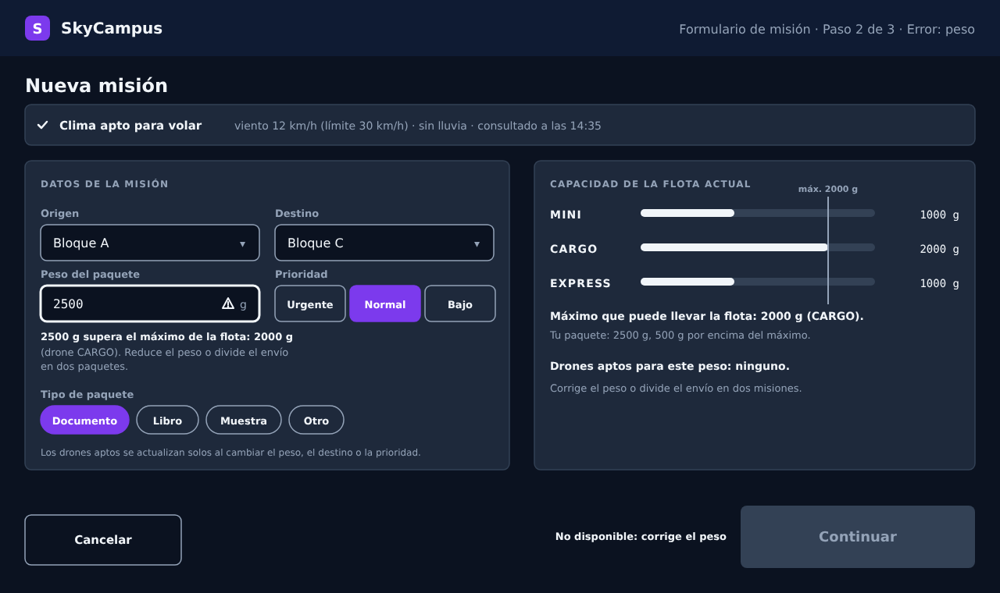

# Monferno · Reto 11 — Flujo de asignación de 3 pantallas con estados de error y heurísticas de Nielsen

Usa la identidad del reto 08 de Chimchar ([`RETO08-MANUAL-IDENTIDAD.md`](RETO08-MANUAL-IDENTIDAD.md)) y los componentes del reto 08 de Monferno ([`MONFERNO08-SISTEMA-DISENO-V2.md`](MONFERNO08-SISTEMA-DISENO-V2.md)): mismos colores, tipografía, tarjeta de drone, indicador de batería y botones. Los datos (ids, baterías, distancia, ETA) son ilustrativos.

## 1. Las tres pantallas

| # | Pantalla | Qué hace el operador | Imagen |
|---|---|---|---|
| 1 | Panel de flota | Ve los 20 drones agrupados por estado y pulsa "Nueva misión" | [`pantalla-1-panel-flota`](ux/v2/pantalla-1-panel-flota.png) |
| 2 | Formulario de misión | Indica origen, destino, peso, tipo de paquete y prioridad; ve en tiempo real qué drones son aptos | [`pantalla-2-formulario-mision`](ux/v2/pantalla-2-formulario-mision.png) |
| 3 | Confirmación | Revisa el drone elegido, la ruta estimada y el ETA, y pulsa "Confirmar misión" o "Cancelar" | [`pantalla-3-confirmacion`](ux/v2/pantalla-3-confirmacion.png) |

Los archivos están en `docs/ux/v2/` (`.svg` y `.png`).

- **Panel de flota:** cinco contadores por estado (9 + 5 + 3 + 1 + 2 = 20), el grupo Disponibles abierto y los demás cerrados, "Nueva misión" arriba a la derecha y "Cancelar misión en vuelo" fijo en la esquina inferior derecha, como en el reto 08.
- **Formulario:** franja de clima arriba, datos a la izquierda y "Drones aptos ahora" a la derecha, que se actualiza al cambiar peso, destino o prioridad. El drone propuesto sale marcado con la estrategia "mayor batería" (D-01, 85 %).
- **Confirmación:** drone elegido, estrategia, resumen del paquete, mapa de la ruta con distancia y ETA, y los botones en el mismo sitio que en el formulario (Cancelar a la izquierda, acción principal de 300 × 80 px a la derecha).

## 2. Los tres estados de error

Los tres ocurren en la pantalla 2, porque es donde el sistema ya sabe el peso, el destino y el estado de la flota y del clima.

| Error | Imagen | Qué ve el operador | Salida |
|---|---|---|---|
| Sin drones disponibles | [`error-1-sin-drones`](ux/v2/error-1-sin-drones.png) | "No hay drones disponibles para esta misión" y cómo está la flota: 12 en vuelo, 4 en carga, 1 en fallo, 2 en mantenimiento y 1 Disponible con batería bajo el 30 % | "Programar para más tarde" (principal) o "Reintentar ahora"; "Continuar" deshabilitado con su motivo |
| Condiciones climáticas adversas | [`error-2-clima-adverso`](ux/v2/error-2-clima-adverso.png) | Franja "Vuelos suspendidos por clima" con el dato (viento de 38 km/h, límite 30 km/h; lluvia) y la hora de la consulta. El formulario queda atenuado | "Volver a consultar clima" o "Programar para más tarde"; el flujo queda bloqueado |
| Paquete muy pesado | [`error-3-paquete-pesado`](ux/v2/error-3-paquete-pesado.png) | El campo Peso con borde grueso y triángulo, el mensaje "2500 g supera el máximo de la flota: 2000 g (drone CARGO)" y la capacidad por tipo (MINI 1000 g, CARGO 2000 g, EXPRESS 1000 g) | Corregir el peso o dividir el envío en dos misiones |

**Cómo se marca un error sin rojo:** en el manual de identidad cada color tiene un solo significado y el rojo es el estado Fallo. Por eso los errores usan un borde grueso en el color de texto principal, un ícono (triángulo, cuadrado de parada o equis) y el texto "No disponible: …" junto al botón deshabilitado. Es la misma decisión que se tomó para la batería bajo el mínimo en el reto 08. El error no depende del color.

**El clima también cubre el fallo de la API:** si no responde en 3 s (regla del caso SC-07) el flujo se bloquea igual, con el mensaje "No se pudo verificar el clima". Es un cuarto caso de error que no se dibujó aparte porque usa la misma pantalla.

## 3. Heurísticas de Nielsen

Evaluación heurística hecha sobre el diseño, no una prueba con usuarios.

| # | Heurística | ¿Cumple? | Cómo se aplica |
|---|---|---|---|
| 1 | Visibilidad del estado del sistema | Sí | "Paso n de 3" en la cabecera; contadores por estado en el panel; la franja de clima dice cuándo se consultó (14:35); los drones aptos se recalculan en vivo; el botón deshabilitado dice por qué |
| 2 | Coincidencia con el mundo real | Sí | Vocabulario del dominio: drone, misión, Bloque C, gramos, prioridad Urgente / Normal / Bajo; los tipos MINI, CARGO y EXPRESS se muestran como en el código |
| 3 | Control y libertad del usuario | Sí | "Cancelar" en los pasos 2 y 3 en la misma posición; "Cancelar misión en vuelo" siempre visible; la misión no sale hasta pulsar "Confirmar misión" |
| 4 | Consistencia y estándares | Sí | Mismos componentes del reto 08; acción principal siempre abajo a la derecha (300 × 80 px) y "Cancelar" abajo a la izquierda; un color, un significado |
| 5 | Prevención de errores | Sí | El máximo permitido (2000 g) está bajo el campo antes de escribir; solo se ofrecen drones aptos; "Continuar" se deshabilita ante cualquier error; las listas desplegables y los chips evitan texto libre en origen, destino y tipo |
| 6 | Reconocer en lugar de recordar | Sí | Destinos y tipos en listas y chips; la capacidad por tipo se muestra en el error de peso; la confirmación repite todo lo elegido |
| 7 | Flexibilidad y eficiencia de uso | Parcial | La estrategia viene por defecto y el caso normal se resuelve sin tocarla; "Reintentar" evita volver a llenar el formulario. No se diseñaron atajos de teclado ni plantillas de misión para operadores expertos |
| 8 | Diseño estético y minimalista | Sí | Una acción principal por pantalla; solo el grupo Disponibles está abierto; el panel de aptos muestra 3 drones y no los 20 |
| 9 | Ayudar a reconocer, diagnosticar y recuperarse de errores | Sí | Los tres errores dicen qué pasó, con el dato concreto (12 en vuelo, 38 km/h, 2500 g frente a 2000 g) y qué hacer: programar, reconsultar o corregir el peso. Ninguno usa códigos técnicos |
| 10 | Ayuda y documentación | No | No hay ayuda contextual ni enlace a documentación. Una mejora posible: un "?" junto a cada regla (máximo 2000 g, límite de viento) que explique su origen |

**Resultado:** 8 de 10 se cumplen, 1 parcialmente (7) y 1 no se cubre (10), por encima del mínimo de 7 que pide el reto.

## 4. Lo que el diseño pide y el código no tiene

| Elemento del diseño | Estado en el código v2 |
|---|---|
| "Programar para más tarde" | No existe ni en SC-07 ni en `GestorFlota`; haría falta una historia nueva (misión programada y reintento) |
| Ruta estimada y ETA | No existen en `Mision` ni en `SolicitudMision`; haría falta calcular distancia entre bloques |
| Estados En carga y Mantenimiento, y Disponible con batería baja | Ver la diferencia señalada en el reto 08: `EstadoDrone` solo tiene DISPONIBLE, EN_VUELO, ATERRIZANDO y FALLO |
| Capacidad por tipo (CARGO 2000 g, EXPRESS 1000 g) | Supuesto de RN-04 del caso SC-07; solo MINI (1000 g) existe en `EstrategiaTipoSegunPaquete` |
| Consulta del clima | Es un sistema externo del reto 05; no está integrado |
| Reconsulta del clima cada 5 minutos | Supuesto mío para el diseño; no está en SC-07 |

## 5. Supuestos y límites
- **Diferencia con el flujo del reto 08 de Monferno:** allí el operador asigna una solicitud pendiente (panel, detalle, confirmación). Aquí, según este enunciado, el operador crea la misión desde un formulario. Se asume que "Nueva misión" registra la solicitud y el sistema la asigna con las mismas reglas del caso SC-07.
- **Fuentes del render:** DejaVu Sans y DejaVu Sans Mono sustituyen a Inter y JetBrains Mono, que no estaban instaladas.
- **Diseño estático:** imágenes SVG y PNG, sin prototipo interactivo; los errores se muestran como pantallas aparte.
- **Táctil:** como en el reto 08, el diseño es de sala de control con mouse; algunos botones internos miden menos de 44 px.
