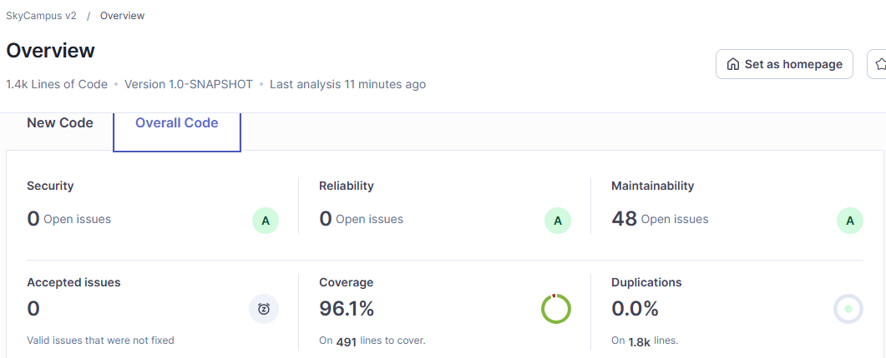
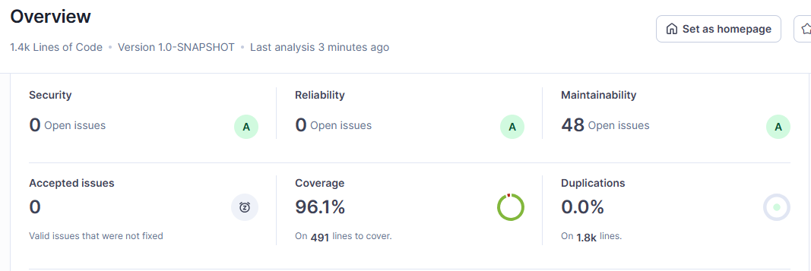

# Monferno · Reto 13 — Quality Gate de SkyCampus v2

La v2 no llega a producción si no pasa dos controles: el build de Maven (JaCoCo) y el Quality Gate de SonarQube. El primero corta en la máquina de quien programa; el segundo mira además los bugs, las vulnerabilidades y la deuda técnica.

## 1. El gate del build (Maven + JaCoCo)

En `pom.xml`, la ejecución `check` de JaCoCo falla el `mvn verify` si baja alguno de los dos umbrales:

| Contador | Mínimo | Qué mide |
|---|---|---|
| `LINE` | 80 % | Líneas del código que ejecutó alguna prueba |
| `BRANCH` | 70 % | Ramas de cada `if`, `switch` o condición que ejecutó alguna prueba |

```xml
<execution>
  <id>check</id>
  <phase>verify</phase>
  <goals><goal>check</goal></goals>
  <configuration>
    <rules><rule>
      <element>BUNDLE</element>
      <limits>
        <limit><counter>LINE</counter><value>COVEREDRATIO</value><minimum>0.80</minimum></limit>
        <limit><counter>BRANCH</counter><value>COVEREDRATIO</value><minimum>0.70</minimum></limit>
      </limits>
    </rule></rules>
  </configuration>
</execution>
```

**Por qué dos umbrales.** Una línea con un `if` cuenta como cubierta aunque solo se pruebe uno de sus dos caminos. La cobertura de ramas obliga a probar el camino de error, que es donde suelen estar los fallos. El umbral de ramas es más bajo (70 %) porque cubrir todas las ramas cuesta más.

**Alcance.** Se mide todo el código excepto el paquete `app` (las demos con `main`), igual que en SonarQube (`sonar.coverage.exclusions`).

**Cobertura actual** (JaCoCo 0.8.11 sobre las 241 pruebas): líneas 100 % (495 de 495) y ramas 100 % (170 de 170). Los dos umbrales se superan con margen.

**Cómo comprobar que el gate corta.** Si se corre el build con una sola clase de pruebas, la cobertura cae y el build debe fallar:

```
mvn clean verify -Dtest=AsignadorMisionTest
```

Resultado esperado: `BUILD FAILURE` con un mensaje del tipo `Rule violated for bundle skycampus: lines covered ratio is 0.xx, but expected minimum is 0.80`.

## 2. El Quality Gate de SonarQube

Condiciones del gate "SkyCampus v2" sobre el código completo (*Overall Code*):

| Métrica en SonarQube | Condición para fallar | Por qué |
|---|---|---|
| Line Coverage | menor que 80 % | Igual que el gate del build |
| Condition Coverage | menor que 70 % | Igual que el gate del build (ramas) |
| Bugs | mayor que 0 | Un bug es un error probable en ejecución |
| Vulnerabilities | mayor que 0 | Un fallo de seguridad no se negocia |
| Technical Debt | mayor que 30 min | Tiempo estimado para arreglar todos los *code smells* |

Si alguna condición falla, el proyecto queda en rojo ("Failed") y no se puede dar por listo.

### Cómo se crea
1. En SonarQube: *Quality Gates* → *Create* → nombre `SkyCampus v2`.
2. *Add Condition* → *On Overall Code*, una por cada fila de la tabla, con el operador y el valor indicados.
3. *Set as Default*, o asignarlo al proyecto en *Project Settings* → *Quality Gate*.

### Cómo se analiza
```
docker run -d --name sonarqube -p 9000:9000 sonarqube:community
mvn clean verify org.sonarsource.scanner.maven:sonar-maven-plugin:sonar -Dsonar.host.url=http://localhost:9000 -Dsonar.token=<TOKEN>
```
`mvn verify` genera el reporte de JaCoCo (`target/site/jacoco/jacoco.xml`) y el plugin de Sonar lo lee. El nombre del proyecto y la exclusión del paquete `app` de la cobertura están en las propiedades `sonar.*` del `pom.xml`.

## 3. Reglas de Sonar atendidas en el código

| Regla | Qué pide | Qué se hizo |
|---|---|---|
| S106 | No escribir en `System.out` | Las demos y `AlertaOperadorConsola` imprimían con `System.out` en 31 puntos (30 en las demos y 1 en el adaptador). Ahora todos usan `util.Consola.imprimir`, la única clase que toca `System.out` (con la excepción justificada en el código). La salida de las demos no cambió |
| S1699 | No llamar desde el constructor a un método que una subclase pueda cambiar | `GestorFlota.cambiarEstrategia` es `final` |
| S2057 | Declarar `serialVersionUID` en clases serializables | `DestinoInvalidoException` |
| S2486 | No ignorar una excepción sin explicarlo | En `AsignadorMision`, la falla de la API del clima se captura con `ignored` y un comentario que explica la decisión |
| S1128 | Quitar imports sin uso | `GestorFlotaTest` |
| Código muerto | Quitar lo que nadie usa | Se eliminó `TipoDrone.pesoMinimoGramos()`, un acceso que ninguna clase llamaba (y que era la única línea sin cubrir) |

## 4. Antes y después

El análisis se corrió dos veces: sobre el código con el gate ya configurado y sin las correcciones, y otra vez con ellas.

**Antes**



**Después**



## 5. Límites
- El gate de SonarQube se define en el servidor, no en el repositorio; lo que sí queda versionado es el gate del build y las propiedades `sonar.*` del `pom.xml`.
- La exclusión de `app` es solo de cobertura: las demos siguen analizándose en busca de bugs, vulnerabilidades y *code smells*.
- El umbral de 30 minutos de deuda depende de las reglas activas en el perfil de calidad de cada servidor.
