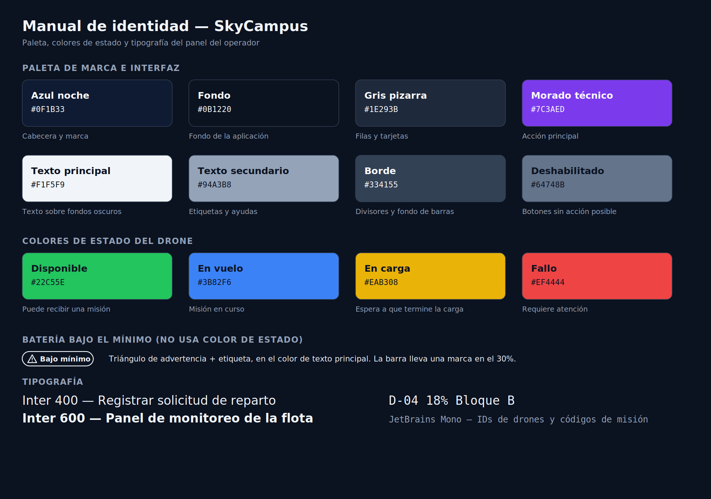
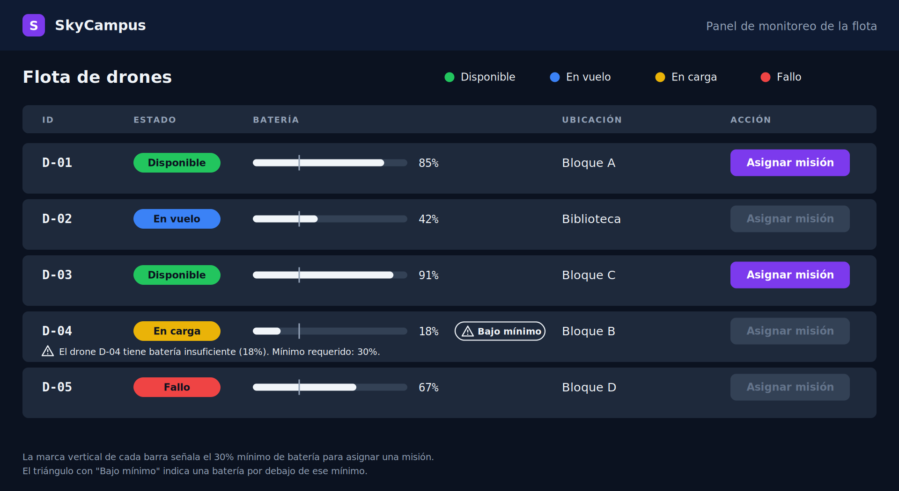

# Reto 08 — Manual de identidad y mock del panel de monitoreo de la flota

## 1. Paleta de marca e interfaz

| Nombre | Hex | Uso | Por qué |
|--------|-----|-----|---------|
| Azul noche | `#0F1B33` | Cabecera y marca | Transmite tecnología y confianza, como una app de control de sistemas |
| Fondo | `#0B1220` | Fondo de la aplicación | Un fondo oscuro reduce el reflejo en una sala de control y hace resaltar los colores de estado |
| Gris pizarra | `#1E293B` | Filas y tarjetas | Separa la información del fondo sin añadir un color nuevo |
| Morado técnico | `#7C3AED` | Acción principal ("Asignar misión") | Color reservado a las acciones: no se usa en ningún estado, así que un botón nunca se confunde con un estado |
| Texto principal | `#F1F5F9` | Texto sobre fondos oscuros | Máxima legibilidad |
| Texto secundario | `#94A3B8` | Etiquetas y ayudas | Baja el peso visual sin perder legibilidad |
| Borde | `#334155` | Divisores y fondo de las barras | |
| Deshabilitado | `#64748B` | Botones sin acción posible | |

Decisión clave: el azul de marca es muy oscuro y el azul del estado "En vuelo" (`#3B82F6`) es más claro y solo aparece en ese estado. Así cada color tiene un único significado.

## 2. Colores de estado del drone (críticos)

| Estado | Hex | Significado | Texto sobre el chip | Contraste |
|--------|-----|-------------|---------------------|-----------|
| Disponible | `#22C55E` | Puede recibir una misión | `#0B1220` | 8,22:1 |
| En vuelo | `#3B82F6` | Misión en curso | `#0B1220` | 5,09:1 |
| En carga | `#EAB308` | Espera a que termine la carga | `#0B1220` | 9,76:1 |
| Fallo | `#EF4444` | Requiere atención | `#0B1220` | 4,98:1 |

### Batería bajo el mínimo

La batería bajo el 30% **no usa ningún color de estado**. Se marca con un triángulo de advertencia y la etiqueta "Bajo mínimo", ambos en el color de texto principal (`#F1F5F9`), y con la marca del 30% en la barra. Así cada color de estado tiene un solo significado y el operador sabe cuál leer.

Regla: el estado nunca se comunica solo con el color. El chip siempre lleva el nombre del estado en texto, para quien no distingue bien los colores.

Contrastes del resto de la paleta (calculados con la fórmula de WCAG; el mínimo AA para texto es 4,5:1):

| Combinación | Contraste |
|-------------|-----------|
| Texto principal sobre fondo | 17,09:1 |
| Texto principal sobre gris pizarra | 13,35:1 |
| Texto secundario sobre gris pizarra | 5,71:1 |
| Blanco sobre morado técnico | 5,70:1 |
| Blanco sobre azul noche | 17,14:1 |

## 3. Tipografía

| Uso | Fuente | Pesos | Por qué |
|-----|--------|-------|---------|
| Interfaz | Inter (sans-serif; respaldo: Segoe UI, Arial) | 400 para texto, 600 para títulos, etiquetas y botones | Sans-serif clara a tamaños pequeños |
| IDs de drones, códigos de misión y porcentajes | JetBrains Mono (respaldo: Consolas, monospace) | 400 | El ancho fijo alinea los caracteres y distingue 0/O y 1/l |

Tamaños: títulos 24, cuerpo entre 15 y 17, etiquetas de columna 12 en mayúsculas con espaciado.

## 4. Tono de voz

Técnico pero claro: el operador es un profesional. Cada mensaje dice qué pasó con el dato concreto y cuál es el límite o qué hacer. Sin exclamaciones ni palabras de programación.

| Sí | No |
|----|----|
| El drone D-04 tiene batería insuficiente (18%). Mínimo requerido: 30%. | Error de asignación |
| El destino "Bloque Z" no existe. Destinos válidos: Bloque A, Bloque B, Bloque C, Bloque D, Biblioteca. | Destino inválido |
| No hay solicitudes pendientes. | ¡Todo al día! |

## 5. Mock del panel de monitoreo de la flota

Generado con IA (Claude) a partir de este manual. El prompt completo, con la paleta, los colores de estado, la tipografía y el contenido escritos dentro, está en [`ux/PROMPT-MOCK-PANEL.md`](ux/PROMPT-MOCK-PANEL.md). La versión 1 del mock no salió de un prompt escrito: se generó a partir del enunciado del reto. La versión 2 (esta) se generó siguiendo ese prompt. Muestra los 5 drones:

| ID | Estado | Batería | Ubicación | Acción |
|----|--------|---------|-----------|--------|
| D-01 | Disponible | 85% | Bloque A | Asignar misión (habilitada) |
| D-02 | En vuelo | 42% | Biblioteca | Deshabilitada |
| D-03 | Disponible | 91% | Bloque C | Asignar misión (habilitada) |
| D-04 | En carga | 18% | Bloque B | Deshabilitada, con el motivo visible |
| D-05 | Fallo | 67% | Bloque D | Deshabilitada |

Notas:
- **Los estados son ilustrativos** para mostrar los cuatro colores. La batería y la ubicación son las de las demos de los retos anteriores, pero en el código D-04 y D-05 aparecen como disponibles.
- **El modelo todavía no distingue los cuatro estados.** El record `Drone` del repo solo tiene `disponible` (verdadero o falso). Para implementar este panel hará falta un dato de estado (por ejemplo `EstadoDrone`) o derivarlo de las misiones.
- **"Asignar misión"** abre el caso de uso SC-01 del reto 07.
- **Fuentes del render:** la imagen usa DejaVu Sans y DejaVu Sans Mono como sustitutas, porque Inter y JetBrains Mono no estaban instaladas. La aplicación usa las del manual.

## 6. Verificación con las heurísticas de Nielsen (cumple 7 de 10)

| # | Heurística | Cómo se ve en el mock |
|---|------------|-----------------------|
| 1 | Visibilidad del estado | Los 5 drones muestran su estado con un chip de color y su nombre, y la batería con una barra y su porcentaje. Todo se ve de un vistazo, sin clics. |
| 2 | Coincidencia con el mundo real | Los estados están en español (Disponible, En vuelo, En carga, Fallo), las ubicaciones son las del campus (Bloque A, Biblioteca) y el botón usa el verbo del operador: "Asignar misión". |
| 4 | Consistencia y estándares | Todas las filas tienen la misma estructura y el mismo orden. Cada color tiene un solo significado y los IDs siempre van en fuente monoespaciada. |
| 5 | Prevención de errores | "Asignar misión" está deshabilitado en los 3 drones que no pueden recibir una misión (D-02, D-04 y D-05), incluido D-04 con 18% de batería. Cada barra marca el mínimo del 30%. El operador no descubre el problema después de asignar. |
| 6 | Reconocimiento antes que memorización | La leyenda de estados está siempre visible, el estado va en texto y el significado de la marca del 30% se explica al pie. El operador no tiene que recordar qué significa cada color. |
| 8 | Diseño minimalista | Solo hay lo que el operador necesita para decidir: ID, estado, batería, ubicación y la acción. |
| 9 | Mensajes de error claros | El motivo del bloqueo de D-04 dice qué drone, qué valor y cuál es el mínimo: "El drone D-04 tiene batería insuficiente (18%). Mínimo requerido: 30%.", y no "Error de asignación". |

No evaluadas en este mock: la 3 (control y libertad), porque el panel no muestra misiones pendientes que se puedan cancelar; la 7 (flexibilidad y eficiencia) y la 10 (ayuda y documentación), porque esta pantalla no incluye atajos ni ayuda.
