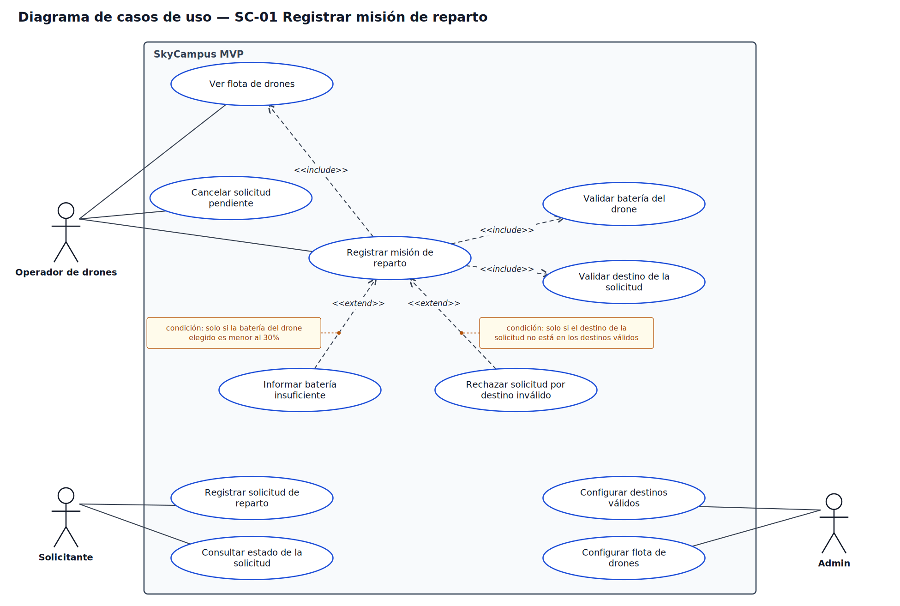

# Reto 10 — Diagrama de casos de uso de SC-01 "Registrar misión de reparto"

Archivos: [`casos-de-uso-sc01.drawio`](uc/casos-de-uso-sc01.drawio) (editable en app.diagrams.net), [`casos-de-uso-sc01.svg`](uc/casos-de-uso-sc01.svg) y [`casos-de-uso-sc01.png`](uc/casos-de-uso-sc01.png).

## 1. Actores y casos de uso

Los 3 actores del MVP están conectados a, al menos, un caso de uso. Todos los casos de uso son elipses con verbo, dentro del rectángulo del sistema SkyCampus MVP.

| Actor | Casos de uso | De dónde sale |
|-------|--------------|---------------|
| Operador de drones | Ver flota de drones | RF-01, HU-1 |
| Operador de drones | **Registrar misión de reparto** | SC-01 (reto 07), RF-03, HU-2 |
| Operador de drones | Cancelar solicitud pendiente | HU-3 (reto 09) |
| Solicitante | Registrar solicitud de reparto | RF-02, flecha 3 del C4 |
| Solicitante | Consultar estado de la solicitud | Flecha 4 del C4 |
| Admin | Configurar destinos válidos | Flecha 5 del C4 |
| Admin | Configurar flota de drones | Flecha 5 del C4 |

## 2. include y extend

La pregunta que los separa: **¿el caso base puede funcionar sin esto?** Si no, es `<<include>>` y ocurre siempre, sin condición. Si sí, es `<<extend>>` y ocurre solo bajo una condición.

| Tipo | Caso | ¿Puede funcionar "Registrar misión de reparto" sin esto? | Condición |
|------|------|-----------------------------------------------------------|-----------|
| `<<include>>` | Validar batería del drone (RN-01, paso 4 de SC-01) | No: sin comprobar la batería no se puede crear la misión | Ninguna, siempre se ejecuta |
| `<<include>>` | Validar destino de la solicitud (RN-02, paso 2 de SC-01) | No: sin comprobar el destino no se puede crear la misión | Ninguna, siempre se ejecuta |
| `<<extend>>` | Informar batería insuficiente (flujo alterno A1) | Sí: si la batería alcanza, la misión se registra sin este caso | Solo si la batería del drone elegido es menor al 30% |
| `<<extend>>` | Rechazar solicitud por destino inválido (flujo alterno A2) | Sí: si el destino es válido, la misión se registra sin este caso | Solo si el destino de la solicitud no está en los destinos válidos |

Por qué cada regla aparece dos veces: **la validación siempre ocurre** (include), pero **lo que se hace cuando la validación falla** solo ocurre si falla (extend). Las flechas del `<<include>>` salen del caso base hacia el caso incluido; las del `<<extend>>` salen del caso que extiende hacia el caso base.

## 3. Coherencia con lo anterior

- **SC-01 y los RF.** El actor de "Registrar misión de reparto" es el Operador de drones, como quedó cerrado en el reto 07 (SC-01 es el RF-03). El Solicitante tiene su caso propio, "Registrar solicitud de reparto" (RF-02).
- **C4 (reto 05).** Las flechas 1 y 2 son del Operador (registrar misión, ver solicitudes pendientes y drones), la 3 y la 4 del Solicitante (registrar la solicitud y recibir su estado) y la 5 y la 6 del Admin (configurar destinos y flota).
- **Jira (reto 09).** HU-1 es "Ver flota de drones", HU-2 es "Registrar misión de reparto" y HU-3 es "Cancelar solicitud pendiente".
- **Flujos de SC-01.** Los dos `<<extend>>` son los flujos alternos A1 y A2 de la plantilla, con las mismas condiciones y los mismos umbrales (30% de batería).

Notas:
- "Cancelar solicitud pendiente" y "Consultar estado de la solicitud" no están entre los 3 RF del reto 06. Quedan como requerimientos pendientes que habría que sumar a esa lista.
- "Registrar misión de reparto" muestra en el paso 2 la lista de drones disponibles, con los mismos datos de "Ver flota de drones". No lo dibujé como `<<include>>` para no duplicar ese caso.
- El archivo `.drawio` se generó junto con el SVG y el PNG; el XML es válido, pero no lo abrí dentro de draw.io. Si algún elemento se ve distinto allí, se ajusta y se vuelve a exportar.
