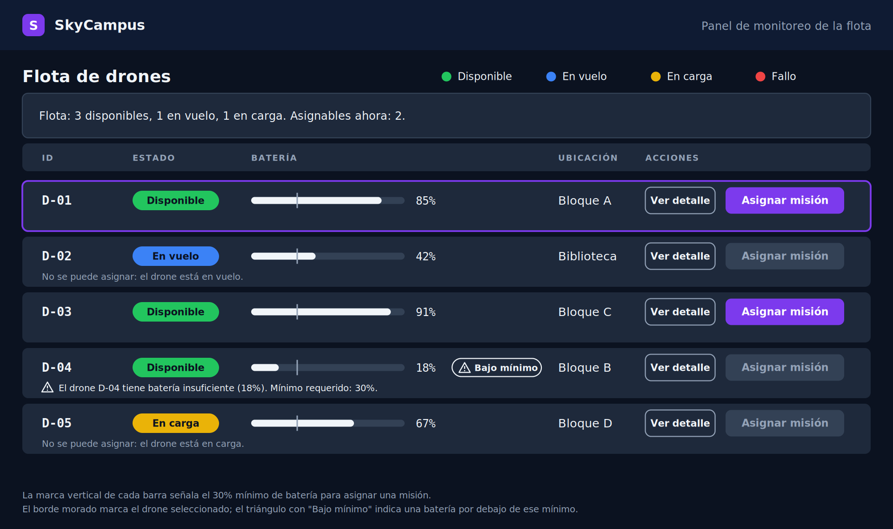
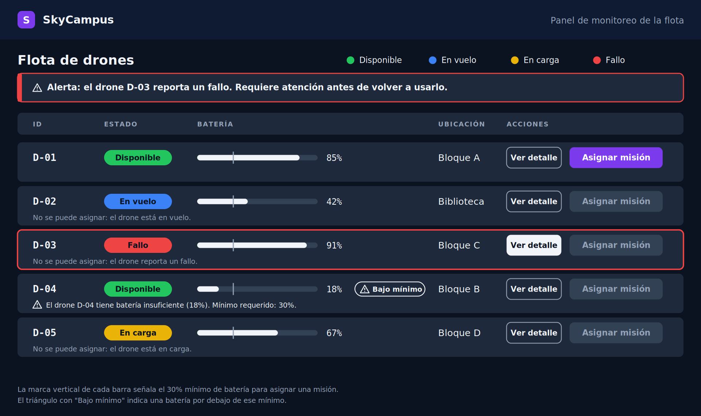
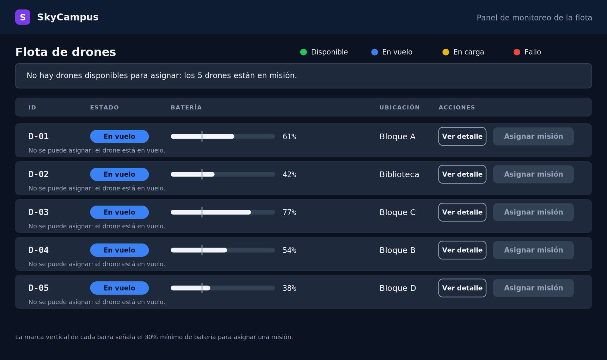

# Reto 11 — Mocks con IA: los 3 estados del panel de monitoreo

El proceso va en 4 pasos y en este orden: referencias, estilo, datos del RF y, al final, el prompt completo. Un prompt como "diseña un panel de control de drones" da un resultado genérico; el mock se deriva de la identidad ya definida y de los datos del RF.

## 1. Proceso

### Paso 1 — Referencias

Dos paneles de sistemas reales de monitoreo de flotas de drones. Lo que dice la documentación de cada producto:

| Referencia | Qué muestra | Lo que tomé | Lo que no tomé |
|------------|-------------|-------------|----------------|
| FlytBase Fleet View 2.0 ([notas de la versión](https://releases.flytbase.com/introducing-fleet-view-2.0) y [documentación](https://docs.flytbase.com/in-flight-modules/how-to-manage-your-flight-operations/multi-view-dashboard)) | Una interfaz de tres paneles (datos en tabla, video y mapa) con indicadores de estado por color, la batería de cada drone, el seguimiento de la misión y la función de fijar un drone para destacarlo | El estado visible y codificado por color en cada fila, la batería como dato de la fila y destacar un drone concreto: en el estado Alerta destaco la fila y el botón "Ver detalle" del drone en fallo | El video en vivo y el mapa 3D: el MVP de SkyCampus no los tiene |
| DJI FlightHub 2 ([guía de usuario oficial](https://enterprise.dji.com/flighthub-2/downloads) y [ficha de un distribuidor](https://www.dronefly.com/products/dji-flighthub-2)) | Una plataforma en la nube que permite seguir la telemetría, la ubicación y el estado operativo de cada aeronave desde una vista central | La idea de una vista central de la flota con el estado y la ubicación de cada aeronave como núcleo de la pantalla | La telemetría detallada y el video: no están en los datos de SC-01 |

La ficha del distribuidor es una página de venta y sirve solo como descripción general; la fuente que muestra el panel es la guía de usuario oficial de DJI.

### Paso 2 — Estilo

El de mi manual de identidad (reto 08, `docs/RETO08-MANUAL-IDENTIDAD.md`): fondo oscuro tipo dashboard técnico `#0B1220`, cabecera `#0F1B33`, filas `#1E293B`, acción principal en morado `#7C3AED`, texto `#F1F5F9` y `#94A3B8`, y los colores de estado Disponible `#22C55E`, En vuelo `#3B82F6`, En carga `#EAB308` y Fallo `#EF4444`. Tipografía Inter, y JetBrains Mono para IDs y porcentajes.

### Paso 3 — Datos del RF

Del caso de uso SC-01 (reto 07) y del RF-01 se extrae qué necesita ver el Operador y qué puede hacer:
- **Datos por drone:** ID, batería, estado y ubicación. Salen de la lista `dronesDisponibles` del paso 2 de SC-01 (`id`, `bateria`, `ubicacion`) y del estado del drone.
- **Acciones:** seleccionar un drone y asignar una misión (pasos 3 y 5 de SC-01), y ver el detalle, que viene de la plantilla del material y no de SC-01.
- **Regla visible:** el mínimo del 30% de batería (RN-01) y el motivo del bloqueo.

### Paso 4 — Prompt

El prompt completo está en [`ux/PROMPT-PANEL-3-ESTADOS.md`](ux/PROMPT-PANEL-3-ESTADOS.md). Sigue la plantilla del material (sistema, pantalla, estilo, actor, datos por drone, acciones y estados) y lleva la identidad escrita dentro. Los 3 estados se generaron con IA (Claude) siguiendo ese texto. El mock del reto 08 no salió de un prompt escrito; estos sí.

## 2. Los 3 estados del panel

La misma pantalla, con el mismo tamaño y la misma estructura, en tres situaciones.

### Normal

Flota con drones en distintos estados y ninguno en fallo. D-01 está seleccionado (borde morado). D-04 está Disponible pero con 18% de batería: su botón queda deshabilitado, con el triángulo "Bajo mínimo" y el mensaje.

### Alerta

D-03 pasa a Fallo y se destaca de tres formas: el chip rojo, el borde rojo de su fila y una franja de alerta arriba. Su botón "Asignar misión" queda deshabilitado con la razón, y "Ver detalle" se resalta como la acción útil.

### Vacío

Los 5 drones están en misión a la vez. Una franja neutra explica por qué no hay nada que asignar, y todos los botones "Asignar misión" están deshabilitados con su razón.

## 3. Un color, un significado

| Estado | Dónde aparece cada color de estado |
|--------|------------------------------------|
| Normal | Rojo: solo en el punto de la leyenda. Amarillo: leyenda y chip de D-05 (En carga). Azul: leyenda y chip de D-02 (En vuelo). Verde: leyenda y los chips Disponible. |
| Alerta | Rojo: leyenda y todo lo que habla del fallo de D-03 (chip, borde de la fila, borde y barra de la franja). Los demás colores, igual que en Normal. |
| Vacío | Azul: leyenda y los 5 chips En vuelo. Rojo, amarillo y verde: solo en la leyenda. La franja usa colores neutros porque informa y no marca ningún estado. |

El morado queda para las acciones (el botón habilitado y el drone seleccionado) y nunca marca un estado. La batería bajo el mínimo no usa ningún color de estado.

## 4. Heurísticas de Nielsen que cumple cada estado

| Estado | Heurística | Cómo se ve en la pantalla |
|--------|------------|---------------------------|
| Normal | #1 Visibilidad del estado | Cada drone muestra su estado con un chip (color y nombre), su batería con barra y porcentaje, y una franja resume la flota: 3 disponibles, 1 en vuelo, 1 en carga, 2 asignables |
| Normal | #5 Prevención de errores | "Asignar misión" está deshabilitado en los 3 drones que no se pueden asignar (D-02, D-04 y D-05), cada uno con su razón escrita; D-04, aunque Disponible, queda bloqueado por la batería |
| Normal | #8 Minimalismo | Solo están los datos que pide el RF (ID, batería, estado, ubicación) y las 3 acciones |
| Alerta | #1 Visibilidad del estado | El fallo de D-03 se ve sin buscarlo: franja de alerta arriba, borde rojo en la fila y chip rojo |
| Alerta | #5 Prevención de errores | D-03 no se puede asignar: el botón está deshabilitado con la razón, y "Ver detalle" queda resaltado como la acción útil |
| Alerta | #8 Minimalismo | Solo cambian la franja y la fila del drone en fallo; el resto de la pantalla es igual que en Normal |
| Vacío | #1 Visibilidad del estado | Una franja explica por qué no hay nada que asignar y los 5 chips dicen En vuelo, así que el operador no se queda ante una pantalla que parece rota |
| Vacío | #5 Prevención de errores | Ningún "Asignar misión" está habilitado y cada uno dice por qué, así que no se puede asignar por error |
| Vacío | #8 Minimalismo | Un solo mensaje y los datos mínimos, sin decoración ni elementos vacíos |

## 5. Notas
- **Fuentes del render:** las imágenes usan DejaVu Sans y DejaVu Sans Mono como sustitutas, porque Inter y JetBrains Mono no estaban instaladas.
- **Datos ilustrativos:** los estados y las baterías se inventaron para mostrar cada situación. D-03 aparece Disponible en Normal y en Fallo en Alerta, y en Vacío las baterías son distintas porque pasó el tiempo.
- **El modelo todavía no distingue los cuatro estados:** el record `Drone` solo tiene `disponible`. Implementar este panel pedirá un dato de estado, como se anotó en el reto 08.
- **"Ver detalle" no tiene caso de uso propio:** viene de la plantilla del material y no está en SC-01 ni en el diagrama del reto 10. Queda como pendiente.
